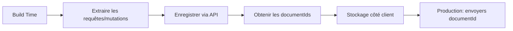

Absolument ! Voici un cours structuré sur l'utilisation d'Undine pour créer des schémas GraphQL, basé sur la documentation officielle. Nous allons partir des bases pour aller vers les concepts avancés.

---

## 📘 Cours : Maîtriser les Schémas GraphQL avec Undine

### Introduction : Le Cœur de l'API

Dans Undine, un schéma GraphQL est défini par des **RootTypes** (types racines). Il existe trois types racines :
*   **`Query`** : Point d'entrée pour la lecture des données (obligatoire).
*   **`Mutation`** : Point d'entrée pour l'écriture/modification des données (optionnel).
*   **`Subscription`** : Point d'entrée pour les données en temps réel (optionnel, abordé dans une autre section).

Chaque `RootType` contient des **`Entrypoint`** , qui sont les "champs" de l'API, c'est-à-dire les opérations que vos clients pourront exécuter.

---

### Partie 1 : Niveau Débutant - Les Fondamentaux

#### 1. Créer un RootType `Query`

C'est le point de départ de votre schéma. Il doit contenir au moins un `Entrypoint`.

```python
# 1. Importer les classes nécessaires
from undine import RootType, Entrypoint

# 2. Définir votre RootType Query
class Query(RootType):
    """
    Ceci est la racine de lecture de mon API.
    Une description peut être ajoutée via un docstring.
    """

    # 3. Définir un Entrypoint basé sur une fonction simple
    @Entrypoint
    def hello(self, name: str) -> str:
        """
        Dit bonjour à quelqu'un.
        :param name: Le nom de la personne à saluer.
        """
        return f"Bonjour, {name} !"
```

**Explications :**
*   `Query` hérite de `RootType`.
*   `@Entrypoint` transforme la méthode en un champ de l'API GraphQL.
*   Le type de retour (`-> str`) définit le type de sortie du champ.
*   Les paramètres typés (`name: str`) deviennent des arguments obligatoires de la requête.
*   Les docstrings fournissent des descriptions qui apparaîtront dans la documentation de l'API (comme GraphiQL).

#### 2. Démarrer le Serveur

Pour voir votre schéma en action, utilisez la commande de gestion d'Undine :

```bash
python manage.py runserver
```

Rendez-vous sur `/graphql` (ou l'endpoint configuré) pour tester votre première requête :

```graphql
query {
  hello(name: "Mon étudiant")
}
```

#### 3. Ajouter un RootType `Mutation`

Le principe est identique, mais pour les opérations qui modifient des données.

```python
from undine import RootType, Entrypoint

class Mutation(RootType):
    """Opérations d'écriture sur mon API."""

    @Entrypoint
    def add(self, a: int, b: int) -> int:
        """Additionne deux nombres et retourne le résultat."""
        return a + b
```

**Note :** Si vous créez une classe `Mutation`, vous devez l'ajouter à la configuration de votre schéma (le processus de création du schéma n'est pas détaillé ici, mais cela se fait généralement dans un fichier `schema.py`).

---

### Partie 2 : Niveau Intermédiaire - Personnalisation et Réutilisation

#### 1. Personnaliser les `Entrypoint`

Vous pouvez affiner le comportement de vos points d'entrée avec des arguments.

```python
class Query(RootType):
    @Entrypoint(
        schema_name="greeting",           # Renomme le champ en camelCase
        description="Un message personnalisé",
        deprecation_reason="Utilisez 'hello' à la place", # Marque comme déprécié
        nullable=True,                     # Le champ peut retourner 'null'
    )
    def hello(self, name: str) -> str:
        return f"Bonjour, {name} !"

    # Exemple avec un argument optionnel
    @Entrypoint
    def greet(self, name: str, greeting: str | None = None) -> str:
        """Salue quelqu'un avec un message personnalisé ou un message par défaut."""
        if greeting:
            return f"{greeting}, {name} !"
        return f"Bonjour, {name} !"
```

#### 2. Gérer les Permissions

Sécurisez vos `Entrypoint` avec des décorateurs de permission.

```python
from undine import RootType, Entrypoint

class Query(RootType):
    @Entrypoint
    def secret_data(self) -> str:
        return "Données ultra-secrètes"

    # Ajouter une vérification de permission
    @secret_data.permissions
    def can_view_secret(self, info):
        # 'info' contient le contexte de la requête (ex: l'utilisateur)
        user = info.context.user
        if not user.is_authenticated:
            return False
        # Ici, une logique plus complexe (vérifier un groupe, une permission Django, etc.)
        return user.has_perm('app.view_secret')
```

**Important :** La méthode décorée `can_view_secret` doit retourner `True` ou `False`. Si `False`, l'exécution du `Entrypoint` est bloquée.

#### 3. Utiliser des Objets Complexes avec `TypedDict`

Pour retourner des objets structurés depuis un `Entrypoint` basé sur une fonction, utilisez un `TypedDict`.

```python
from typing import TypedDict
from undine import RootType, Entrypoint

class UserInfo(TypedDict):
    id: int
    name: str
    email: str

class Query(RootType):
    @Entrypoint
    def get_user(self, user_id: int) -> UserInfo:
        # Simulons une recherche en base de données
        if user_id == 1:
            return {"id": 1, "name": "Alice", "email": "alice@example.com"}
        return {"id": user_id, "name": "Inconnu", "email": None}
```

---

### Partie 3 : Niveau Avancé - Optimisation et Fonctionnalités Évoluées

#### 1. Intégration avec les Modèles Django (`QueryType` et `MutationType`)

C'est là qu'Undine montre toute sa puissance. Vous pouvez lier vos `Entrypoint` directement à des modèles Django.

```python
# models.py
from django.db import models

class Article(models.Model):
    title = models.CharField(max_length=200)
    content = models.TextField()
    published_at = models.DateTimeField(auto_now_add=True)
```

```python
# schema/queries.py
from undine import RootType, Entrypoint
from undine.django import QueryType
from .models import Article

# Définir un QueryType pour le modèle Article
class ArticleType(QueryType):
    class Meta:
        model = Article
        fields = ["id", "title", "content", "published_at"]
        # Vous pouvez ajouter des filtres (FilterSet) et des tris (OrderSet) ici

class Query(RootType):
    # Entrypoint pour récupérer UN article par son ID
    article = Entrypoint(ArticleType)

    # Entrypoint pour récupérer LA LISTE des articles
    # many=True active le filtrage, le tri et la pagination automatiques
    articles = Entrypoint(ArticleType, many=True)
```

```python
# schema/mutations.py
from undine import RootType, Entrypoint
from undine.django import MutationType
from .models import Article

class ArticleMutationType(MutationType):
    class Meta:
        model = Article
        # Définit les champs modifiables par la mutation
        fields = ["title", "content"]

class Mutation(RootType):
    # Entrypoint pour créer un article
    create_article = Entrypoint(ArticleMutationType)
    # Entrypoint pour modifier un article (nécessite un ID)
    update_article = Entrypoint(ArticleMutationType)
```

#### 2. Optimiser les Requêtes avec un `Resolver` Personnalisé

Pour éviter les problèmes N+1 lors de l'utilisation de `QueryType`, vous pouvez surcharger le résolveur et utiliser l'optimiseur intégré d'Undine.

```python
from undine import RootType, Entrypoint
from undine.django import QueryType, optimize_sync
from .models import Article

class ArticleType(QueryType):
    # ... Meta class ...

class Query(RootType):
    article = Entrypoint(ArticleType)

    @article.resolve
    def resolve_article(self, root, info, article_id: int):
        # Cette méthode remplace le résolveur par défaut d'ArticleType
        # On utilise l'optimiseur pour pré-charger les relations nécessaires
        queryset = optimize_sync(
            Article.objects.select_related('author'), # Exemple de pré-chargement
            info,
            ArticleType
        )
        try:
            return queryset.get(id=article_id)
        except Article.DoesNotExist:
            return None
```

#### 3. Mettre en Cache pour la Performance

Undine propose un système de cache intégré pour les `Entrypoint` de type `Query`.

```python
class Query(RootType):
    # Cache la réponse de ce champ pendant 60 secondes
    @Entrypoint(cache_time=60)
    def expensive_data(self) -> list:
        # ... calcul très long ...
        return [1, 2, 3]

    # Cache la réponse par utilisateur (si User A et User B reçoivent des données différentes)
    @Entrypoint(cache_time=120, cache_per_user=True)
    def user_profile(self) -> dict:
        user = info.context.user
        # ... charger le profil ...
        return {"name": user.name}
```

#### 4. Rendre un `Entrypoint` Optionnel (Visibilité Avancée)

Avec la fonctionnalité expérimentale `visibility`, vous pouvez cacher complètement un champ à certains utilisateurs (il n'apparaît pas dans l'introspection et son utilisation génère une erreur "champ inconnu").

```python
# settings.py
UNDINE = {
    'EXPERIMENTAL_VISIBILITY_CHECKS': True,
    'ALLOW_DID_YOU_MEAN_SUGGESTIONS': False, # Important à désactiver
}

# schema.py
class Query(RootType):
    admin_field = Entrypoint()

    @admin_field.visible
    def is_admin_visible(self, request):
        # 'request' est l'objet HttpRequest de Django
        return request.user.is_superuser
```

#### 5. Ajouter des Directives

Vous pouvez attacher des directives GraphQL à vos `RootType` et `Entrypoint`.

```python
from undine import RootType, Entrypoint
from undine.directives import MyDirective # Directive créée ailleurs

@RootType(directives=[MyDirective()])
class Query(RootType):
    @Entrypoint
    @MyDirective() # Utilisation avec l'opérateur @
    def standard_field(self) -> str:
        return "Hello"
```

#### 6. Exporter le Schéma

Pour finir, vous pouvez exporter votre schéma au format SDL (Schema Definition Language) avec une commande :

```bash
python manage.py print_schema > mon_schema.graphql
```

Cela génère un fichier `.graphql` qui peut être utilisé pour la documentation, l'intégration client, ou le versioning.

---

### Conclusion

Vous avez maintenant une vue d'ensemble de la création de schémas GraphQL avec Undine :
1.  **Débutant** : Créer des `RootType` et des `Entrypoint` simples.
2.  **Intermédiaire** : Personnaliser les champs, gérer les permissions et retourner des objets structurés.
3.  **Avancé** : Exploiter la puissance de l'intégration Django (`QueryType`, `MutationType`), optimiser les requêtes, mettre en cache, et utiliser des fonctionnalités avancées comme la visibilité et les directives.

N'hésitez pas à consulter la [documentation d'Undine](https://mrthearman.github.io/undine/) pour explorer les sujets complémentaires comme les `InterfaceType`, `UnionType`, les `Subscription` et la configuration avancée.

Voici un cours structuré sur les **Queries dans Undine**, basé sur la documentation officielle. Nous allons explorer comment exposer vos modèles Django via GraphQL de manière efficace et flexible.

---

## 📘 Cours : Maîtriser les Queries GraphQL avec Undine

### Introduction : Exposer vos Données Django

Undine fournit les **`QueryType`** , une classe puissante qui transforme vos modèles Django en `ObjectType` GraphQL. C'est la manière privilégiée de créer des points d'entrée en lecture pour vos données.

Un `QueryType` se base sur un modèle Django et contient des **`Field`** , qui représentent les champs du modèle exposés dans l'API.

---

### Partie 1 : Niveau Débutant - Créer un QueryType Simple

#### 1. Définir un `QueryType` avec Génération Automatique

Le moyen le plus rapide est de laisser Undine générer les champs pour vous.

```python
# models.py
from django.db import models

class Task(models.Model):
    title = models.CharField(max_length=200)
    completed = models.BooleanField(default=False)
    created_at = models.DateTimeField(auto_now_add=True)

# schema/queries.py
from undine.django import QueryType
from .models import Task

# La génération automatique crée un GraphQL ObjectType avec tous les champs du modèle
class TaskType(QueryType[Task], auto=True):
    """Représente une tâche dans le système."""
    pass
```

**Explications :**
*   `QueryType[Task]` : Lie le `QueryType` au modèle `Task`.
*   `auto=True` : Active la génération automatique des champs. Undine inspecte le modèle et crée un champ GraphQL pour chaque champ Django.
*   Le docstring devient la description du type dans l'API.

#### 2. Utiliser le `QueryType` dans un `Entrypoint`

Une fois le `QueryType` créé, vous pouvez l'utiliser comme référence dans un `Entrypoint` de votre `RootType` `Query`.

```python
# schema/schema.py
from undine import RootType, Entrypoint
from .queries import TaskType

class Query(RootType):
    # Récupère une tâche unique par son ID
    task = Entrypoint(TaskType)

    # Récupère la liste de toutes les tâches
    tasks = Entrypoint(TaskType, many=True)
```

**Résultat dans le schéma GraphQL :**
```graphql
type Query {
  task(id: ID!): Task
  tasks(offset: Int, limit: Int, ...): [Task!]!
}

type Task {
  id: ID!
  title: String!
  completed: Boolean!
  createdAt: DateTime!
}
```

#### 3. Personnaliser les Champs Exposés

Vous pouvez exclure certains champs du modèle si vous ne voulez pas les exposer.

```python
class TaskType(QueryType[Task], auto=True, exclude=["created_at"]):
    """Tâche sans la date de création."""
    pass
```

---

### Partie 2 : Niveau Intermédiaire - Personnalisation Avancée

#### 1. Filtrer et Ordonner les Résultats

Pour les listes (quand `many=True`), vous pouvez ajouter des capacités de filtrage et de tri.

```python
# filters.py
from undine.django import FilterSet
from .models import Task

class TaskFilterSet(FilterSet):
    class Meta:
        model = Task
        fields = {
            "title": ["exact", "icontains"],
            "completed": ["exact"],
        }

# schema/queries.py
from undine.django import QueryType
from .models import Task
from .filters import TaskFilterSet

class TaskType(QueryType[Task], auto=True):
    class Meta:
        filterset = TaskFilterSet  # Ajoute les filtres
        # orderset = TaskOrderSet   # Ajoute le tri (si défini)
```

**Dans le schéma GraphQL :**
```graphql
type Query {
  tasks(
    offset: Int,
    limit: Int,
    title: String,        # Filtre exact
    title_Icontains: String, # Filtre "contient"
    completed: Boolean
  ): [Task!]!
}
```

#### 2. Gérer les Permissions

Vous pouvez contrôler l'accès aux données à deux niveaux.

**Au niveau du `QueryType` (pour chaque instance retournée) :**

```python
from undine.exceptions import GraphQLPermissionError

class TaskType(QueryType[Task], auto=True):
    @classmethod
    def __permissions__(cls, root: Task, info):
        # root est l'instance de Task
        user = info.context.user
        if root.assigned_to != user and not user.is_staff:
            raise GraphQLPermissionError("Vous n'avez pas accès à cette tâche.")
```

**Ou filtrer silencieusement les éléments non autorisés :**

```python
class TaskType(QueryType[Task], auto=True):
    @classmethod
    def __filter_queryset__(cls, queryset, info):
        # Cette méthode filtre TOUJOURS les résultats
        user = info.context.user
        return queryset.filter(assigned_to=user)  # Ne montre que ses tâches
```

#### 3. Ajouter des Champs Personnalisés avec des `Field`

Parfois, vous avez besoin d'exposer un champ qui n'existe pas directement dans le modèle.

```python
from undine.django import QueryType, Field
from datetime import date

class TaskType(QueryType[Task], auto=True):
    # Référence par nom de champ du modèle (équivalent à l'auto-génération)
    title = Field()

    # Champ calculé basé sur une fonction
    @Field
    def is_overdue(self, root: Task) -> bool:
        """Vérifie si la tâche est en retard."""
        return root.due_date and root.due_date < date.today() and not root.completed

    # Champ basé sur une expression Django (annotation)
    days_remaining = Field(models.ExpressionWrapper(
        models.F('due_date') - models.F('created_at'),
        output_field=models.DurationField()
    ))
```

**Résultat :**
```graphql
type Task {
  title: String!
  isOverdue: Boolean!
  daysRemaining: Duration!
}
```

---

### Partie 3 : Niveau Avancé - Optimisation et Cas Complexes

#### 1. Gérer les Relations entre Modèles

Undine optimise automatiquement les requêtes sur les relations.

```python
# models.py
class Project(models.Model):
    name = models.CharField(max_length=100)

class Task(models.Model):
    title = models.CharField(max_length=200)
    project = models.ForeignKey(Project, on_delete=models.CASCADE, related_name='tasks')

# schema/queries.py
class ProjectType(QueryType[Project], auto=True):
    # 'tasks' est un champ de relation many-to-one
    tasks = Field()

class TaskType(QueryType[Task], auto=True):
    # 'project' est un champ de relation many-to-one
    project = Field()
```

**Requête GraphQL optimisée (évite les problèmes N+1) :**
```graphql
query {
  tasks(limit: 10) {
    title
    project {   # Undine pré-charge le projet pour toutes les tâches
      name
    }
  }
}
```

#### 2. Créer des Champs avec `Calculation` (Calculs en Base de Données)

Pour des calculs complexes qui dépendent d'arguments, `Calculation` permet de faire le travail directement en base de données.

```python
from undine.django import QueryType, Calculation, CalculationArgument
from django.db import models
from datetime import timedelta

class DaysSinceDueCalculation(Calculation[float]):
    """Calcule le nombre de jours depuis l'échéance."""
    # Arguments du calcul
    relative_date = CalculationArgument(
        models.DateField,
        required=True,
        description="Date de référence pour le calcul"
    )

    def __call__(self, root: Task, info, relative_date: date) -> models.Expression:
        # Retourne une expression SQL annotée
        return models.ExpressionWrapper(
            models.F('due_date') - relative_date,
            output_field=models.DurationField()
        )

class TaskType(QueryType[Task], auto=True):
    days_since = Field(DaysSinceDueCalculation)
```

**Utilisation :**
```graphql
query {
  task(id: 1) {
    title
    daysSince(relativeDate: "2024-01-01")  # Calcul fait en DB
  }
}
```

#### 3. Gérer les Erreurs comme Données ("Error as Data")

Pour éviter que les erreurs ne bloquent toute la requête, vous pouvez déclarer les exceptions qu'un champ peut lever.

```python
from undine.django import QueryType, Field
from undine.exceptions import GraphQLValidationError

class TaskType(QueryType[Task], auto=True):
    # Ce champ peut lever une erreur de validation
    title = Field(errors=[GraphQLValidationError])
```

**Dans le schéma :** Le champ `title` devient une union `TitleResult` qui peut être soit `TaskTitle`, soit `GraphQLValidationError`.

```graphql
query {
  task(id: 1) {
    title {
      __typename
      ... on TaskTitle {
        value
      }
      ... on GraphQLValidationError {
        message
      }
    }
  }
}
```

#### 4. Optimisation Avancée avec `__optimizations__`

Pour les cas où vous avez besoin de données externes (comme l'utilisateur) pour optimiser les requêtes.

```python
class TaskType(QueryType[Task], auto=True):
    @classmethod
    def __optimizations__(cls, info):
        # Ajoute un pré-chargement conditionnel basé sur l'utilisateur
        optimizations = []
        user = info.context.user
        if user.is_staff:
            # Les admins peuvent voir les détails de l'assigné
            optimizations.append(models.Prefetch('assigned_to'))
        return optimizations
```

#### 5. Cacher des Champs avec `visibility` (Expérimental)

```python
# settings.py
UNDINE = {
    'EXPERIMENTAL_VISIBILITY_CHECKS': True,
    'ALLOW_DID_YOU_MEAN_SUGGESTIONS': False,
}

class TaskType(QueryType[Task], auto=True):
    internal_notes = Field()

    @internal_notes.visible
    def can_see_notes(self, request):
        return request.user.is_staff
```

Les utilisateurs non-staff ne verront pas le champ `internalNotes` du tout (ni dans l'introspection, ni dans les requêtes).

---

### Conclusion et Bonnes Pratiques

1.  **Pour débuter** : Utilisez `auto=True` pour gagner du temps, mais surveillez ce que vous exposez.
2.  **Pour les relations** : Laissez Undine gérer l'optimisation, mais vérifiez avec l'outil `print_schema` que les types sont corrects.
3.  **Pour la performance** :
    *   Utilisez `__filter_queryset__` pour les restrictions globales.
    *   Préférez `Calculation` aux résolveurs Python pour les calculs intensifs.
    *   Évitez les résolveurs personnalisés qui accèdent à des relations sans pré-chargement.
4.  **Pour la sécurité** : Combinez les permissions au niveau du `QueryType` (`__permissions__`) et des `Entrypoint` pour une protection fine.

N'hésitez pas à consulter la documentation sur le [Filtrage](https://mrthearman.github.io/undine/filtering/), l'[Ordonnancement](https://mrthearman.github.io/undine/ordering/) et l'[Optimiseur](https://mrthearman.github.io/undine/optimizer/) pour approfondir.

Voici un cours structuré sur les **Mutations dans Undine**, basé sur la documentation officielle. Nous allons apprendre à créer, modifier et supprimer des données via GraphQL en utilisant vos modèles Django.

---

## 📘 Cours : Maîtriser les Mutations GraphQL avec Undine

### Introduction : Modifier vos Données

Undine fournit les **`MutationType`** , une classe qui transforme vos modèles Django en `InputObjectType` GraphQL. C'est la manière standard de créer des points d'entrée pour les opérations d'écriture (création, mise à jour, suppression).

Un `MutationType` se base sur un modèle Django et contient des **`Input`** , qui représentent les champs modifiables.

---

### Partie 1 : Niveau Débutant - Créer des Mutations Simples

#### 1. Définir un `MutationType` avec Génération Automatique

Le moyen le plus rapide est de laisser Undine générer les champs d'entrée pour vous.

```python
# models.py
from django.db import models

class Task(models.Model):
    title = models.CharField(max_length=200)
    completed = models.BooleanField(default=False)
    due_date = models.DateField(null=True, blank=True)

# schema/mutations.py
from undine.django import MutationType
from .models import Task

# Mutation de création
class TaskCreateMutation(MutationType[Task], auto=True):
    """Crée une nouvelle tâche."""
    pass

# Mutation de mise à jour
class TaskUpdateMutation(MutationType[Task], auto=True):
    """Met à jour une tâche existante."""
    pass

# Mutation de suppression
class TaskDeleteMutation(MutationType[Task], auto=True):
    """Supprime une tâche."""
    pass
```

**Explications :**
*   `MutationType[Task]` : Lie la mutation au modèle `Task`.
*   `auto=True` : Génère automatiquement les `Input` (champs d'entrée) à partir du modèle.
*   Undine détermine automatiquement le **type de mutation** (create, update, delete) en analysant le nom de la classe.

#### 2. Utiliser les `MutationType` dans un `Entrypoint`

```python
# schema/schema.py
from undine import RootType, Entrypoint
from .mutations import TaskCreateMutation, TaskUpdateMutation, TaskDeleteMutation

class Mutation(RootType):
    create_task = Entrypoint(TaskCreateMutation)
    update_task = Entrypoint(TaskUpdateMutation)
    delete_task = Entrypoint(TaskDeleteMutation)
```

**Schéma GraphQL généré :**
```graphql
type Mutation {
  createTask(input: TaskCreateMutationInput!): TaskCreateMutationPayload!
  updateTask(input: TaskUpdateMutationInput!): TaskUpdateMutationPayload!
  deleteTask(input: TaskDeleteMutationInput!): TaskDeleteMutationPayload!
}

input TaskCreateMutationInput {
  title: String!
  completed: Boolean
  dueDate: Date
}

input TaskUpdateMutationInput {
  pk: ID!                     # Clé primaire pour identifier la tâche
  title: String
  completed: Boolean
  dueDate: Date
}

input TaskDeleteMutationInput {
  pk: ID!
}
```

#### 3. Exécuter des Mutations

```graphql
# Création
mutation {
  createTask(input: {title: "Apprendre Undine"}) {
    task {
      id
      title
      completed
    }
  }
}

# Mise à jour
mutation {
  updateTask(input: {pk: 1, completed: true}) {
    task {
      id
      title
      completed
    }
  }
}

# Suppression
mutation {
  deleteTask(input: {pk: 1}) {
    task {
      id
      title
    }
  }
}
```

---

### Partie 2 : Niveau Intermédiaire - Personnalisation Avancée

#### 1. Gérer les Permissions

```python
from undine.exceptions import GraphQLPermissionError

class TaskUpdateMutation(MutationType[Task], auto=True):
    """Met à jour une tâche."""

    @classmethod
    def __permissions__(cls, instance: Task, info):
        # 'instance' est la tâche à modifier
        user = info.context.user
        if instance.assigned_to != user and not user.is_staff:
            raise GraphQLPermissionError(
                "Vous ne pouvez modifier que vos propres tâches."
            )
```

#### 2. Ajouter des Validations

```python
from undine.exceptions import GraphQLValidationError
from datetime import date

class TaskCreateMutation(MutationType[Task], auto=True):
    """Crée une nouvelle tâche."""

    @classmethod
    def __validate__(cls, instance: Task, info, input_data):
        # 'instance' est la nouvelle tâche (pas encore sauvegardée)
        if instance.due_date and instance.due_date < date.today():
            raise GraphQLValidationError(
                "La date d'échéance ne peut pas être dans le passé."
            )
```

#### 3. Personnaliser un `Input` avec Validation Spécifique

```python
from undine.django import MutationType, Input

class TaskCreateMutation(MutationType[Task], auto=True):
    # On peut redéfinir un input pour ajouter une validation
    title = Input()

    @title.validate
    def validate_title(self, info, value: str):
        if len(value) < 3:
            raise GraphQLValidationError(
                "Le titre doit comporter au moins 3 caractères."
            )
        return value
```

#### 4. Utiliser des `Input` Masqués (Hidden Inputs)

Les inputs cachés n'apparaissent pas dans le schéma, mais sont ajoutés automatiquement à la mutation.

```python
from undine.django import MutationType, Input

class TaskCreateMutation(MutationType[Task], auto=True):
    # Champ caché pour attribuer la tâche à l'utilisateur connecté
    assigned_to = Input(hidden=True)

    @assigned_to.convert
    def set_assigned_to(self, value=None):
        # Cette méthode est appelée pour définir la valeur du champ caché
        from django.contrib.auth import get_user_model
        User = get_user_model()
        # On retourne l'utilisateur actuel (accessible via le contexte)
        return self.context.user
```

**Note :** Les `Input` cachés ne peuvent pas être fournis par le client.

---

### Partie 3 : Niveau Avancé - Cas Complexes

#### 1. Mutations de Relations (Related Mutations)

Imaginons deux modèles liés : `Task` et `Project`.

```python
# models.py
class Project(models.Model):
    name = models.CharField(max_length=100)

class Task(models.Model):
    title = models.CharField(max_length=200)
    project = models.ForeignKey(Project, on_delete=models.CASCADE, related_name='tasks')
```

Nous pouvons créer une mutation qui gère la création d'une tâche **et** de son projet associé en une seule opération.

```python
# schema/mutations.py
from undine.django import MutationType

class ProjectCreateMutation(MutationType[Project], auto=True):
    """Crée un projet (peut être utilisé dans une mutation liée)."""
    pass

class TaskCreateMutation(MutationType[Task], auto=True):
    """Crée une tâche, avec possibilité de créer/lier un projet."""
    project = Input(ProjectCreateMutation, related=True)  # <-- Mutation liée
```

**Schéma généré :**
```graphql
input TaskCreateMutationInput {
  title: String!
  project: ProjectCreateMutationInput   # On peut imbriquer une mutation !
}

input ProjectCreateMutationInput {
  name: String!
}
```

**Utilisation :**
```graphql
# Créer une tâche et un nouveau projet en une fois
mutation {
  createTask(input: {
    title: "Implémenter les mutations liées",
    project: {name: "Formation Undine"}
  }) {
    task {
      id
      title
      project { id name }
    }
  }
}

# Créer une tâche et la lier à un projet existant
mutation {
  createTask(input: {
    title: "Tester les mutations liées",
    project: {pk: 5}   # On ne fournit que la clé primaire
  }) {
    task { id title project { name } }
  }
}
```

#### 2. Gérer les Relations avec des Actions Spécifiques

Pour les relations "one-to-many" ou "many-to-many", vous pouvez définir ce qui arrive aux objets existants non sélectionnés.

```python
class ProjectUpdateMutation(MutationType[Project], auto=True):
    """Met à jour un projet et ses tâches."""
    # related_action définit le comportement pour les tâches existantes
    # qui ne sont pas incluses dans la mutation
    tasks = Input(TaskCreateMutation, many=True, related=True,
                  related_action="delete")  # Valeurs possibles: "null", "delete", "ignore"
```

**Explications :**
*   `"null"` (défaut) : Déconnecte les relations non listées (met la clé étrangère à NULL). Erreur si non-nullable.
*   `"delete"` : Supprime les objets non listés.
*   `"ignore"` : Laisse les relations existantes inchangées.

#### 3. Créer des Mutations Complètement Personnalisées

Si la logique est trop complexe pour les mutations standard, vous pouvez tout contrôler.

```python
from undine.django import MutationType, Input
from undine.exceptions import GraphQLValidationError

class TaskSpecialMutation(MutationType[Task], kind="custom"):
    """Mutation personnalisée avec logique métier complexe."""
    # Définition manuelle des inputs
    title = Input()
    mark_as_important = Input(bool, required=False)

    @classmethod
    def __mutate__(cls, root, info, input_data):
        # input_data contient les valeurs fournies par l'utilisateur
        title = input_data.get('title')
        important = input_data.get('mark_as_important', False)

        # Logique personnalisée
        if important and not title:
            raise GraphQLValidationError(
                "Impossible de marquer comme important sans titre."
            )

        # Création ou mise à jour...
        task = Task.objects.create(title=title)
        if important:
            # Notifier un service externe, etc.
            pass

        # Retourner l'instance créée (sera sérialisée par le QueryType associé)
        return task
```

**Note :** Avec `kind="custom"`, l'auto-génération est désactivée et vous devez définir tous les `Input` explicitement.

#### 4. Mutations Atomiques avec la Directive `@atomic`

Pour exécuter plusieurs mutations dans une seule opération de manière transactionnelle (tout ou rien).

```python
# schema/schema.py
from undine import RootType, Entrypoint
from undine.django import MutationType
from .models import Task, Project

class Mutation(RootType):
    create_task = Entrypoint(TaskCreateMutation)
    create_project = Entrypoint(ProjectCreateMutation)
```

**Requête GraphQL :**
```graphql
mutation @atomic {
  createTask(input: {title: "Tâche atomique"}) {
    task { id }
  }
  createProject(input: {name: "Projet atomique"}) {
    project { id }
  }
}
```

Si **une seule** des mutations échoue, **aucune** modification n'est appliquée. Cette fonctionnalité est désactivée par défaut en mode asynchrone.

---

### Conclusion et Bonnes Pratiques

1.  **Pour débuter** : Utilisez `auto=True` et laissez Undine déterminer automatiquement le type (create, update, delete).
2.  **Pour la sécurité** : Ajoutez toujours des permissions (`__permissions__`) et des validations (`__validate__`) à vos mutations.
3.  **Pour les relations** :
    *   Utilisez les **related mutations** (`related=True`) pour les opérations complexes.
    *   Choisissez soigneusement l'`related_action` pour contrôler le comportement des relations non sélectionnées.
4.  **Pour les cas particuliers** : Les **inputs cachés** (`hidden=True`) sont excellents pour injecter des données système (comme l'utilisateur courant) sans les exposer au client.
5.  **Pour l'intégrité des données** : Envisagez d'utiliser la directive `@atomic` pour les opérations critiques.

N'hésitez pas à consulter la documentation sur les [Mutations Personnalisées](https://mrthearman.github.io/undine/custom-mutations/) et les [Directives](https://mrthearman.github.io/undine/directives/) pour aller plus loin.


Parfait ! Voici un cours structuré sur le **filtrage dans Undine**, basé sur la documentation officielle. Nous allons apprendre à créer des systèmes de filtrage puissants et flexibles pour vos requêtes GraphQL.

---

## 📘 Cours : Maîtriser le Filtrage avec Undine

### Introduction : Pourquoi Filtrer ?

Lorsque vous exposez des listes de données via GraphQL, vos clients ont souvent besoin de récupérer des sous-ensembles spécifiques. Undine fournit les **`FilterSet`** et les **`Filter`** pour créer des arguments de filtrage riches et intuitifs, similaires aux `filter()` de Django mais exposés via l'API GraphQL.

---

### Partie 1 : Niveau Débutant - Filtrer des Champs Simples

#### 1. Créer un `FilterSet` avec Génération Automatique

Le moyen le plus rapide est de laisser Undine générer tous les filtres possibles pour votre modèle.

```python
# models.py
from django.db import models

class Task(models.Model):
    title = models.CharField(max_length=200)
    completed = models.BooleanField(default=False)
    created_at = models.DateTimeField(auto_now_add=True)
    due_date = models.DateField(null=True, blank=True)

# schema/filters.py
from undine.django import FilterSet
from .models import Task

class TaskFilterSet(FilterSet[Task], auto=True):
    """Filtres disponibles pour les tâches."""
    pass
```

**Ce qui est généré :** Undine crée automatiquement un `InputObjectType` GraphQL avec :
- Des filtres pour chaque champ (ex: `title`, `completed`, `dueDate`).
- Des **lookups** courants pour chaque type de champ (`exact`, `contains`, `gt`, `lt`, `in`, etc.).
- Des opérateurs logiques (`NOT`, `AND`, `OR`, `XOR`) pour combiner les conditions.

#### 2. Ajouter le `FilterSet` à un `QueryType`

```python
# schema/queries.py
from undine.django import QueryType
from .models import Task
from .filters import TaskFilterSet

class TaskType(QueryType[Task], auto=True):
    class Meta:
        filterset = TaskFilterSet   # <-- On lie le FilterSet

# schema/schema.py
from undine import RootType, Entrypoint
from .queries import TaskType

class Query(RootType):
    tasks = Entrypoint(TaskType, many=True)  # Le filtrage est automatiquement disponible
```

**Résultat dans le schéma GraphQL :**
```graphql
type Query {
  tasks(
    filter: TaskFilterSet   # <-- L'argument de filtrage apparaît !
    offset: Int
    limit: Int
  ): [Task!]!
}

input TaskFilterSet {
  title: String
  titleContains: String
  titleExact: String
  completed: Boolean
  dueDate: Date
  dueDateGt: Date
  dueDateLt: Date
  # ... et bien d'autres
  AND: TaskFilterSet
  OR: TaskFilterSet
  NOT: TaskFilterSet
}
```

#### 3. Utiliser les Filtres dans les Requêtes

```graphql
# Tâches non terminées dont le titre contient "urgent"
query {
  tasks(filter: {
    completed: false,
    titleContains: "urgent"
  }) {
    title
    dueDate
  }
}
```

```graphql
# Combinaison avec AND/OR
query {
  tasks(filter: {
    OR: [
      { dueDateLt: "2024-12-31" },
      { titleContains: "important" }
    ]
  }) {
    title
    dueDate
  }
}
```

---

### Partie 2 : Niveau Intermédiaire - Personnaliser les Filtres

#### 1. Exclure des Champs ou Lookups

Si vous ne voulez pas exposer certains filtres, utilisez l'argument `exclude`.

```python
class TaskFilterSet(FilterSet[Task], auto=True, exclude=["created_at", "title__exact"]):
    """Filtres disponibles, sans la date de création et sans le 'exact' sur le titre."""
    pass
```

#### 2. Définir des Filtres Manuels pour un Contrôle Précis

```python
from undine.django import FilterSet, Filter
from django.db.models import Q

class TaskFilterSet(FilterSet[Task]):
    # Filtre basé sur un champ du modèle (équivalent à l'auto-gen)
    title = Filter()  # Par défaut, lookup "exact"

    # Filtre avec un lookup différent
    completed = Filter(lookup="exact")

    # Filtre personnalisé avec une fonction
    @Filter
    def is_overdue(self, value: bool) -> Q:
        """Filtre les tâches en retard."""
        if value:
            return Q(due_date__lt=date.today()) & Q(completed=False)
        return Q(due_date__gte=date.today()) | Q(completed=True)

    # Filtre sur une expression Django
    days_remaining = Filter(models.ExpressionWrapper(
        models.F('due_date') - models.F('created_at'),
        output_field=models.DurationField()
    ), lookup="gte")
```

#### 3. Filtrer sur des Relations

Si votre modèle a des relations, vous pouvez filtrer dessus.

```python
# models.py
class Project(models.Model):
    name = models.CharField(max_length=100)

class Task(models.Model):
    title = models.CharField(max_length=200)
    project = models.ForeignKey(Project, on_delete=models.CASCADE)

# filters.py
class TaskFilterSet(FilterSet[Task]):
    # Filtre sur le nom du projet
    project_name = Filter("project__name", lookup="icontains")
```

**Utilisation :**
```graphql
query {
  tasks(filter: { projectName: "formation" }) {
    title
    project { name }
  }
}
```

#### 4. Filtrer avec une Liste de Valeurs (`many`)

Vous pouvez créer des filtres qui acceptent une liste de valeurs.

```python
class TaskFilterSet(FilterSet[Task]):
    # Filtre qui accepte plusieurs titres
    title = Filter(many=True, match="any")  # "any" (défaut), "all", ou "one_of"
```

**Utilisation :**
```graphql
query {
  tasks(filter: { title: ["urgent", "important"] }) {
    title
  }
}
```
Cela génère une condition `Q(title__exact="urgent") | Q(title__exact="important")` (avec `match="any"`).

#### 5. Ajouter des Permissions aux Filtres

```python
from undine.exceptions import GraphQLPermissionError

class TaskFilterSet(FilterSet[Task]):
    sensitive_field = Filter()

    @sensitive_field.permissions
    def can_filter_sensitive(self, info, value):
        user = info.context.user
        if not user.is_staff:
            raise GraphQLPermissionError(
                "Vous ne pouvez pas utiliser ce filtre."
            )
        return value  # Retourner la valeur pour continuer
```

---

### Partie 3 : Niveau Avancé - Filtres Complexes et Optimisation

#### 1. Filtrer avec des Sous-Requêtes (Expressions)

```python
from django.db import models
from undine.django import FilterSet, Filter

class TaskFilterSet(FilterSet[Task]):
    # Sous-requête : tâches dont le projet a un nom spécifique
    project_with_name = Filter(
        models.Subquery(
            Project.objects.filter(
                pk=models.OuterRef('project_id')
            ).values('name')[:1]
        ),
        lookup="icontains"
    )
```

#### 2. Ajouter des Aliases pour l'Optimisation

Si votre filtre nécessite d'ajouter une annotation à la queryset, utilisez `aliases`.

```python
from undine.django import FilterSet, Filter

class TaskFilterSet(FilterSet[Task]):
    @Filter(aliases="alias_method")
    def complex_filter(self, value: str) -> Q:
        # Retourne une condition Q
        return Q(title__icontains=value)

    @classmethod
    def alias_method(cls, queryset, filter_name, value):
        # Cette méthode est appelée pour ajouter une annotation avant le filtrage
        return queryset.annotate(
            custom_field=models.F('title')
        )
```

#### 3. Filtrage Global avec `__filter_queryset__`

Vous pouvez ajouter des règles de filtrage qui s'appliquent **toujours**, quel que soit l'utilisateur.

```python
class TaskFilterSet(FilterSet[Task], auto=True):
    @classmethod
    def __filter_queryset__(cls, queryset, info):
        # Exclut les tâches archivées
        return queryset.exclude(archived=True)
```

**Ordre d'exécution :**
1. `__filter_queryset__` du `QueryType`
2. `__filter_queryset__` du `FilterSet`
3. Filtres définis dans le `FilterSet` (via l'argument `filter`)

#### 4. Gérer les Valeurs Vides

Par défaut, Undine ignore les valeurs "vides" (`None`, `""`, `[]`) pour les filtres. Vous pouvez personnaliser ce comportement.

```python
class TaskFilterSet(FilterSet[Task]):
    # Ce filtre acceptera une chaîne vide comme valeur valide
    title = Filter(empty_values=[])
```

#### 5. Rendre un Filtre Obligatoire

```python
class TaskFilterSet(FilterSet[Task]):
    # Si un filtrage est utilisé, ce champ DOIT être fourni
    title = Filter(required=True)
```

**Attention :** Si vous rendez un filtre obligatoire, l'utilisateur devra toujours le fournir, même dans des blocs `OR` ou `AND`.

#### 6. Éviter les Doublons avec `distinct`

Si votre filtre traverse une relation "to-many" et peut générer des doublons, activez `distinct`.

```python
class TaskFilterSet(FilterSet[Task]):
    tags = Filter("tags__name", many=True, distinct=True)
```

---

### Synthèse : Bonnes Pratiques

| **Cas d'usage** | **Solution recommandée** |
|-----------------|--------------------------|
| Filtrer sur des champs simples | `auto=True` et éventuellement `exclude` |
| Filtrer sur des relations | Utiliser la syntaxe `"relation__field"` dans un `Filter` manuel |
| Logique métier complexe | `Filter` basé sur une fonction retournant un `Q` |
| Filtrer sur des listes de valeurs | `many=True` avec `match` approprié |
| Filtres globaux (ex: multi-tenant) | `__filter_queryset__` dans le `FilterSet` |
| Sécuriser un filtre spécifique | `@<filter>.permissions` |

### Exemple Complet

```python
class TaskFilterSet(FilterSet[Task], auto=True, exclude=["created_at"]):
    # Filtre relationnel
    project_name = Filter("project__name", lookup="icontains")

    # Filtre booléen personnalisé
    @Filter
    def status(self, value: str) -> Q:
        if value == "done":
            return Q(completed=True)
        elif value == "pending":
            return Q(completed=False, due_date__gte=date.today())
        elif value == "overdue":
            return Q(completed=False, due_date__lt=date.today())
        raise GraphQLValidationError(f"Statut inconnu: {value}")

    # Permissions sur un filtre
    @project_name.permissions
    def can_filter_by_project(self, info, value):
        if not info.context.user.is_staff:
            raise GraphQLPermissionError("Réservé aux administrateurs")
        return value
```

---

N'hésitez pas à consulter la documentation sur l'[Ordonnancement](https://mrthearman.github.io/undine/ordering/) et l'[Optimiseur](https://mrthearman.github.io/undine/optimizer/) pour compléter votre compréhension des requêtes performantes.


Voici un cours structuré sur **l'ordonnancement (ordering) dans Undine**, basé sur la documentation officielle. Nous allons apprendre à trier les résultats de vos requêtes GraphQL de manière flexible et performante.

---

## 📘 Cours : Maîtriser l'Ordonnancement avec Undine

### Introduction : Pourquoi Ordonner ?

Lorsque vous exposez des listes de données, vos clients ont souvent besoin de les trier selon différents critères (date, nom, priorité, etc.). Undine fournit les **`OrderSet`** et les **`Order`** pour créer des options de tri riches, qui se traduisent par un `Enum` GraphQL.

---

### Partie 1 : Niveau Débutant - Trier sur des Champs Simples

#### 1. Créer un `OrderSet` avec Génération Automatique

Le moyen le plus rapide est de laisser Undine générer toutes les possibilités de tri pour votre modèle.

```python
# models.py
from django.db import models

class Task(models.Model):
    title = models.CharField(max_length=200)
    completed = models.BooleanField(default=False)
    created_at = models.DateTimeField(auto_now_add=True)
    due_date = models.DateField(null=True, blank=True)
    priority = models.IntegerField(default=0)  # 0 = basse, 1 = moyenne, 2 = haute

# schema/ordering.py
from undine.django import OrderSet
from .models import Task

class TaskOrderSet(OrderSet[Task], auto=True):
    """Options de tri pour les tâches."""
    pass
```


**Ce qui est généré :** Undine crée automatiquement un `Enum` GraphQL avec :
- Pour chaque champ : `CHAMP_ASC` et `CHAMP_DESC` (ex: `TITLE_ASC`, `TITLE_DESC`, `CREATED_AT_ASC`, etc.)
- Les champs relationnels sont également inclus.

#### 2. Ajouter l'`OrderSet` à un `QueryType`

```python
# schema/queries.py
from undine.django import QueryType
from .models import Task
from .ordering import TaskOrderSet

class TaskType(QueryType[Task], auto=True):
    class Meta:
        orderset = TaskOrderSet   # <-- On lie l'OrderSet

# schema/schema.py
from undine import RootType, Entrypoint
from .queries import TaskType

class Query(RootType):
    tasks = Entrypoint(TaskType, many=True)  # Le tri est automatiquement disponible
```

**Résultat dans le schéma GraphQL :**
```graphql
type Query {
  tasks(
    order: [TaskOrderSet!]   # <-- L'argument de tri apparaît !
    offset: Int
    limit: Int
  ): [Task!]!
}

enum TaskOrderSet {
  TITLE_ASC
  TITLE_DESC
  COMPLETED_ASC
  COMPLETED_DESC
  CREATED_AT_ASC
  CREATED_AT_DESC
  DUE_DATE_ASC
  DUE_DATE_DESC
  PRIORITY_ASC
  PRIORITY_DESC
}
```

#### 3. Utiliser le Tri dans les Requêtes

```graphql
# Tâches triées par priorité (décroissante) puis par date de création
query {
  tasks(order: [PRIORITY_DESC, CREATED_AT_ASC]) {
    title
    priority
    createdAt
  }
}
```

**Remarque :** `order` accepte une **liste** de critères, ce qui permet un tri multi-niveaux.

---

### Partie 2 : Niveau Intermédiaire - Personnaliser les Options de Tri

#### 1. Exclure des Champs du Tri

Si vous ne voulez pas exposer certains champs au tri, utilisez l'argument `exclude`.

```python
class TaskOrderSet(OrderSet[Task], auto=True, exclude=["created_at", "due_date"]):
    """Options de tri, sans la date de création et la date d'échéance."""
    pass
```

#### 2. Définir des Ordres Manuels pour un Contrôle Précis

```python
from undine.django import OrderSet, Order
from django.db import models

class TaskOrderSet(OrderSet[Task]):
    # Tri basé sur un champ du modèle (équivalent à l'auto-gen)
    title = Order()  # Génère TITLE_ASC et TITLE_DESC

    # Tri basé sur une expression Django
    days_remaining = Order(
        models.ExpressionWrapper(
            models.F('due_date') - models.F('created_at'),
            output_field=models.DurationField()
        )
    )

    # Tri personnalisé avec gestion des valeurs nulles
    due_date = Order(null_placement="last")  # Les dates nulles seront placées en dernier
```

**Résultat :**
```graphql
enum TaskOrderSet {
  TITLE_ASC
  TITLE_DESC
  DAYS_REMAINING_ASC
  DAYS_REMAINING_DESC
  DUE_DATE_ASC
  DUE_DATE_DESC
}
```

#### 3. Trier sur des Relations

Si votre modèle a des relations, vous pouvez trier selon les champs de ces relations.

```python
# models.py
class Project(models.Model):
    name = models.CharField(max_length=100)

class Task(models.Model):
    title = models.CharField(max_length=200)
    project = models.ForeignKey(Project, on_delete=models.CASCADE)

# ordering.py
class TaskOrderSet(OrderSet[Task]):
    # Tri par le nom du projet associé
    project_name = Order("project__name")
```

**Utilisation :**
```graphql
query {
  tasks(order: [PROJECT_NAME_ASC]) {
    title
    project { name }
  }
}
```

#### 4. Gérer la Position des Valeurs Nulles

Pour les champs nullables, vous pouvez contrôler où apparaissent les valeurs nulles dans le tri.

```python
class TaskOrderSet(OrderSet[Task]):
    due_date = Order(null_placement="last")      # Les nulls en dernier (par défaut)
    # due_date = Order(null_placement="first")   # Les nulls en premier
    # due_date = Order(null_placement=None)      # Comportement par défaut de la BDD
```

---

### Partie 3 : Niveau Avancé - Cas Complexes

#### 1. Trier avec des Expressions et Sous-Requêtes

```python
from django.db import models
from undine.django import OrderSet, Order

class TaskOrderSet(OrderSet[Task]):
    # Trier par le nombre de commentaires (sous-requête)
    comment_count = Order(
        models.Subquery(
            Comment.objects.filter(
                task=models.OuterRef('pk')
            ).values('task')
            .annotate(cnt=models.Count('id'))
            .values('cnt')[:1]
        )
    )
```

#### 2. Ajouter des Aliases pour l'Optimisation

Si votre tri nécessite d'ajouter une annotation à la queryset, utilisez `aliases`.

```python
from undine.django import OrderSet, Order

class TaskOrderSet(OrderSet[Task]):
    @Order(aliases="alias_method")
    def priority_weighted(self):
        # Cette méthode retourne l'expression de tri
        return models.ExpressionWrapper(
            models.F('priority') * models.Value(100),
            output_field=models.IntegerField()
        )

    @classmethod
    def alias_method(cls, queryset, order_name):
        # Ajoute une annotation avant d'appliquer le tri
        return queryset.annotate(
            weighted_priority=models.F('priority') * models.Value(100)
        )
```

#### 3. Trier par Champs Non Modèles (Fonctions Personnalisées)

Vous pouvez créer des ordres basés sur des fonctions Python, mais attention aux performances.

```python
class TaskOrderSet(OrderSet[Task]):
    # Ce tri ne peut pas être fait en base de données
    @Order
    def custom_complexity(self, root):
        # root est une instance de Task
        # Cette méthode est appelée pour chaque élément → risque de N+1 !
        return root.compute_complexity()
```

**⚠️ Attention :** Les `Order` basés sur des fonctions sont exécutés **en Python**, pas en base de données. Pour des listes importantes, privilégiez les expressions Django.

#### 4. Utiliser l'Ordre par Défaut avec `__filter_queryset__`

Vous pouvez définir un ordre par défaut qui s'applique toujours, sauf si l'utilisateur en spécifie un autre.

```python
class TaskType(QueryType[Task], auto=True):
    @classmethod
    def __filter_queryset__(cls, queryset, info):
        # Ordre par défaut : priorité décroissante, puis date de création
        return queryset.order_by('-priority', 'created_at')
```

**Règle :** Si l'utilisateur fournit un `order` dans sa requête, il remplace l'ordre par défaut.

---

### Synthèse : Bonnes Pratiques

| **Cas d'usage** | **Solution recommandée** |
|-----------------|--------------------------|
| Trier sur des champs simples | `auto=True` et éventuellement `exclude` |
| Trier sur des relations | Utiliser la syntaxe `"relation__field"` dans un `Order` manuel |
| Trier sur des calculs complexes | Utiliser une `Expression` Django ou une sous-requête |
| Gérer les valeurs nulles | `null_placement="first"` ou `"last"` |
| Ordre par défaut global | `__filter_queryset__` dans le `QueryType` |
| Tri multi-niveaux | L'argument `order` accepte une liste |

### Exemple Complet

```python
# ordering.py
from undine.django import OrderSet, Order
from django.db import models

class TaskOrderSet(OrderSet[Task], auto=True, exclude=["created_at"]):
    # Tri manuel avec gestion des nulls
    due_date = Order(null_placement="last")

    # Tri sur une expression
    @Order
    def title_length(self):
        return models.functions.Length('title')

    # Tri sur une relation
    project_name = Order("project__name")

# queries.py
from undine.django import QueryType
from .models import Task
from .ordering import TaskOrderSet

class TaskType(QueryType[Task], auto=True):
    class Meta:
        orderset = TaskOrderSet

    @classmethod
    def __filter_queryset__(cls, queryset, info):
        # Ordre par défaut pour les requêtes sans "order"
        return queryset.order_by('-priority')
```

**Requête possible :**
```graphql
query {
  tasks(
    order: [PROJECT_NAME_ASC, DUE_DATE_ASC, TITLE_LENGTH_DESC]
  ) {
    title
    priority
    dueDate
    project { name }
  }
}
```

---

### Complément : Combiner Filtrage et Ordonnancement

Les `FilterSet` et `OrderSet` peuvent être utilisés ensemble sans conflit.

```python
class TaskType(QueryType[Task], auto=True):
    class Meta:
        filterset = TaskFilterSet
        orderset = TaskOrderSet
```

**Requête complète :**
```graphql
query {
  tasks(
    filter: { completed: false, priorityGte: 1 }
    order: [DUE_DATE_ASC]
    limit: 10
  ) {
    title
    dueDate
    priority
  }
}
```

N'hésitez pas à consulter la documentation sur le [Filtrage](https://mrthearman.github.io/undine/filtering/) et l'[Optimiseur](https://mrthearman.github.io/undine/optimizer/) pour approfondir l'optimisation des performances.

Voici un cours structuré sur la **pagination dans Undine**, basé sur la documentation officielle. Nous allons apprendre à ajouter de la pagination à vos requêtes GraphQL, que ce soit avec la pagination offset simple ou la pagination par curseur plus robuste.

---

## 📘 Cours : Maîtriser la Pagination avec Undine

### Introduction : Pourquoi Paginer ?

Lorsque vous exposez des listes de données potentiellement volumineuses, il est essentiel de ne pas tout renvoyer d'un coup. Undine supporte deux méthodes de pagination :
- **Offset pagination** : simple, basée sur un décalage (offset) et une limite (limit).
- **Cursor pagination** : plus robuste, basée sur des curseurs opaques, idéale pour les listes dynamiques.

---

### Partie 1 : Niveau Débutant - Pagination Offset

La pagination offset est la plus simple à comprendre et à mettre en œuvre. Elle fonctionne bien lorsque l'ordre des éléments est stable (tri par date de création, par exemple).

#### 1. Ajouter la Pagination Offset à un `Entrypoint`

```python
# schema/queries.py
from undine.django import QueryType
from undine.pagination import OffsetPagination
from undine import RootType, Entrypoint
from .models import Task

class TaskType(QueryType[Task], auto=True):
    pass

class Query(RootType):
    # Pagination offset sur la liste des tâches
    tasks = Entrypoint(
        OffsetPagination(TaskType, many=True)
    )
```

**Ce que cela génère dans le schéma GraphQL :**
```graphql
type Query {
  tasks(offset: Int, limit: Int): OffsetPaginationTask!
}

type OffsetPaginationTask {
  items: [Task!]!
  totalCount: Int!
}
```

#### 2. Utiliser la Pagination Offset dans une Requête

```graphql
query {
  # Page 1 : 10 premiers éléments
  tasks(offset: 0, limit: 10) {
    items {
      id
      title
    }
    totalCount  # Nombre total d'éléments (utile pour calculer le nombre de pages)
  }
}
```

#### 3. Pagination Offset sur un Champ de Relation

Vous pouvez aussi paginer les relations "many" directement.

```python
# schema/queries.py
from undine.django import QueryType, Field
from undine.pagination import OffsetPagination
from .models import Project

class ProjectType(QueryType[Project], auto=True):
    # Les tâches d'un projet sont paginées
    tasks = Field(OffsetPagination(TaskType, many=True))
```

**Requête correspondante :**
```graphql
query {
  project(id: 1) {
    name
    tasks(offset: 0, limit: 5) {
      items { title }
      totalCount
    }
  }
}
```

---

### Partie 2 : Niveau Intermédiaire - Pagination par Curseur (Cursor)

La pagination par curseur est plus robuste : les curseurs sont des identifiants opaques qui ne changent pas même si des éléments sont ajoutés ou supprimés entre deux requêtes. Elle suit la **GraphQL Cursor Connections Specification**.

#### 1. Ajouter une `Connection` (Cursor Pagination)

```python
# schema/queries.py
from undine.django import QueryType
from undine.pagination import Connection
from undine import RootType, Entrypoint
from .models import Task

class TaskType(QueryType[Task], auto=True):
    pass

class Query(RootType):
    tasks = Entrypoint(
        Connection(TaskType, many=True)
    )
```

**Schéma GraphQL généré :**
```graphql
type Query {
  tasks(
    first: Int,
    after: String,
    last: Int,
    before: String
  ): TaskConnection!
}

type TaskConnection {
  edges: [TaskEdge!]!
  pageInfo: PageInfo!
  totalCount: Int!
}

type TaskEdge {
  node: Task!
  cursor: String!
}

type PageInfo {
  hasNextPage: Boolean!
  hasPreviousPage: Boolean!
  startCursor: String
  endCursor: String
}
```

#### 2. Utiliser la Pagination par Curseur

```graphql
query {
  # Première page : les 10 premières tâches
  tasks(first: 10) {
    edges {
      node {
        id
        title
      }
      cursor  # Curseur pour la pagination suivante
    }
    pageInfo {
      hasNextPage
      endCursor   # Curseur à utiliser pour la page suivante
    }
    totalCount
  }
}
```

**Pour la page suivante :**
```graphql
query {
  tasks(first: 10, after: "YXJyYXljb25uZWN0aW9uOjE=") {
    edges { node { title } cursor }
    pageInfo { hasNextPage endCursor }
  }
}
```

#### 3. Pagination par Curseur sur un Champ de Relation

```python
class ProjectType(QueryType[Project], auto=True):
    tasks = Field(Connection(TaskType, many=True))
```

---

### Partie 3 : Niveau Avancé - Personnalisation et Optimisation

#### 1. Combiner Pagination, Filtrage et Tri

Les `FilterSet` et `OrderSet` s'intègrent parfaitement avec les deux types de pagination.

```python
# schema/queries.py
from undine.django import QueryType, FilterSet, OrderSet
from undine.pagination import Connection
from .models import Task

class TaskFilterSet(FilterSet[Task], auto=True):
    pass

class TaskOrderSet(OrderSet[Task], auto=True):
    pass

class TaskType(QueryType[Task], auto=True):
    class Meta:
        filterset = TaskFilterSet
        orderset = TaskOrderSet

class Query(RootType):
    tasks = Entrypoint(
        Connection(TaskType, many=True)
    )
```

**Requête complète :**
```graphql
query {
  tasks(
    first: 10
    after: "cursor"
    filter: { completed: false }
    order: [CREATED_AT_DESC]
  ) {
    edges { node { title } }
    pageInfo { hasNextPage endCursor }
    totalCount
  }
}
```

#### 2. Modifier la Taille par Défaut des Pages

```python
# settings.py
UNDINE = {
    'PAGINATION_PAGE_SIZE': 20,  # 20 éléments par page par défaut
}
```

Ou directement dans le code :
```python
tasks = Entrypoint(
    Connection(TaskType, many=True, page_size=50)  # 50 par page pour ce champ
)
```

**Pour désactiver la pagination sur un champ spécifique :**
```python
tasks = Entrypoint(
    Connection(TaskType, many=True, page_size=None)  # Retourne tous les éléments
)
```

#### 3. Pagination Personnalisée avec `PaginationHandler`

Si les stratégies par défaut ne correspondent pas à vos besoins, vous pouvez créer votre propre gestionnaire.

```python
from undine.pagination import PaginationHandler, OffsetPagination
from undine.typing import GQLInfo

class CustomPaginationHandler(PaginationHandler):
    def paginate_queryset(self, queryset, info: GQLInfo, **kwargs):
        # Logique de pagination personnalisée
        # kwargs contient les arguments GraphQL (first, after, etc.)
        limit = kwargs.get('limit', 10)
        offset = kwargs.get('offset', 0)
        return queryset[offset:offset+limit], queryset.count()

# Utilisation
class Query(RootType):
    tasks = Entrypoint(
        OffsetPagination(TaskType, many=True, handler=CustomPaginationHandler())
    )
```

#### 4. Attention au `totalCount` dans les Connexions

Pour les connexions imbriquées, le calcul de `totalCount` peut être coûteux car il nécessite une sous-requête pour chaque élément parent.

```python
# Si vous n'avez pas besoin du totalCount, vous pouvez l'ignorer
# La requête sera plus rapide
query {
  project(id: 1) {
    tasks(first: 10) {
      edges { node { title } }
      pageInfo { hasNextPage }  # totalCount est absent
    }
  }
}
```

#### 5. Support de Relay (Global Object IDs)

Pour les clients compatibles Relay, Undine peut ajouter le support de l'interface `Node`.

```python
# Ajoutez cette configuration
UNDINE = {
    'RELAY_COMPATIBLE': True,  # Active les Global Object IDs
}
```

Ensuite, vos types hériteront automatiquement de l'interface `Node` et vous pourrez faire :
```graphql
query {
  node(id: "VGFzazox") {
    ... on Task {
      title
    }
  }
}
```

---

### Synthèse : Offset vs Cursor

| **Critère** | **Offset Pagination** | **Cursor Pagination** |
|-------------|----------------------|----------------------|
| **Simplicité** | Très simple | Plus complexe |
| **Performance** | Bonne | Bonne (avec index) |
| **Stabilité** | Problème si la liste change (doublons/sauts) | Robuste aux changements |
| **Cas d'usage** | Listes triées par index stable (ex: date de création) | Listes dynamiques, flux d'actualités |
| **Informations** | `items`, `totalCount` | `edges`, `pageInfo`, `totalCount` |
| **Arguments** | `offset`, `limit` | `first`, `after`, `last`, `before` |

### Exemple Complet

```python
# schema/queries.py
from undine.django import QueryType, FilterSet, OrderSet
from undine.pagination import Connection
from undine import RootType, Entrypoint
from .models import Task

class TaskFilterSet(FilterSet[Task], auto=True, exclude=["created_at"]):
    class Meta:
        fields = {
            "title": ["icontains"],
            "completed": ["exact"],
            "priority": ["gte", "lte"],
        }

class TaskOrderSet(OrderSet[Task], auto=True):
    pass

class TaskType(QueryType[Task], auto=True):
    class Meta:
        filterset = TaskFilterSet
        orderset = TaskOrderSet

class Query(RootType):
    tasks = Entrypoint(
        Connection(TaskType, many=True, page_size=20)
    )
```

**Requête finale :**
```graphql
query GetTasks($first: Int!, $after: String, $filter: TaskFilterSet, $order: [TaskOrderSet!]) {
  tasks(first: $first, after: $after, filter: $filter, order: $order) {
    edges {
      node {
        id
        title
        completed
        priority
      }
      cursor
    }
    pageInfo {
      hasNextPage
      endCursor
    }
    totalCount
  }
}
```

N'hésitez pas à consulter la documentation sur les [Global Object IDs](https://mrthearman.github.io/undine/global-ids/) pour le support complet de Relay, et l'[Optimiseur](https://mrthearman.github.io/undine/optimizer/) pour améliorer les performances des requêtes paginées.


Voici un cours structuré sur les **subscriptions dans Undine**, basé sur la documentation officielle. Nous allons apprendre à ajouter du temps réel à votre API GraphQL.

---

## 📘 Cours : Maîtriser les Subscriptions avec Undine

### Introduction : Le Temps Réel dans GraphQL

Les **subscriptions** permettent à vos clients de recevoir des mises à jour en temps réel depuis votre serveur. Contrairement aux queries et mutations, une subscription maintient une connexion active et envoie des données lorsqu'un événement se produit.

---

### Partie 1 : Niveau Débutant - Configuration et Première Subscription

#### 1. Activer le Mode Asynchrone

Les subscriptions nécessitent le mode asynchrone d'Undine.

```python
# settings.py
UNDINE = {
    'ASYNC_MODE': True,  # Obligatoire pour les subscriptions
}
```

#### 2. Choisir un Protocole de Transport

Undine supporte trois protocoles :

| **Protocole** | **Cas d'usage** | **Configuration** |
|---------------|-----------------|-------------------|
| **WebSockets** | Client tooling standard, support large | Nécessite `channels` |
| **Server-Sent Events (SSE)** | Simplicité, traverse les proxies | Mode distinct (simple) ou mode single (avec channels) |
| **Multipart HTTP** | Apollo GraphOS Router | Sans configuration supplémentaire |

**Pour une prise en main rapide avec SSE en mode distinct (le plus simple) :**
```python
# Aucune configuration supplémentaire nécessaire !
# Les connexions SSE seront ouvertes par subscription.
```

#### 3. Créer une Subscription Simple avec `AsyncGenerator`

```python
# schema/subscriptions.py
import asyncio
from typing import AsyncGenerator
from undine import RootType, Entrypoint

class Subscription(RootType):
    @Entrypoint
    async def countdown(self, from_value: int = 10) -> AsyncGenerator[int, None]:
        """Compte à rebours depuis une valeur donnée."""
        for i in range(from_value, 0, -1):
            await asyncio.sleep(1)
            yield i
```

**Schéma GraphQL généré :**
```graphql
type Subscription {
  countdown(fromValue: Int = 10): Int!
}
```

#### 4. Utiliser la Subscription

```graphql
subscription {
  countdown(fromValue: 5)
}
```

**Réponses reçues (toutes les secondes) :**
```json
{"data": {"countdown": 5}}
{"data": {"countdown": 4}}
{"data": {"countdown": 3}}
{"data": {"countdown": 2}}
{"data": {"countdown": 1}}
```

---

### Partie 2 : Niveau Intermédiaire - Gestion des Erreurs et Arguments

#### 1. Ajouter des Arguments et Gérer les Erreurs

```python
from typing import AsyncGenerator
from undine import RootType, Entrypoint
from undine.exceptions import GraphQLValidationError

class Subscription(RootType):
    @Entrypoint
    async def countdown(self, from_value: int = 10) -> AsyncGenerator[int, None]:
        """Compte à rebours avec validation."""
        if from_value < 1:
            raise GraphQLValidationError("La valeur de départ doit être >= 1")

        for i in range(from_value, 0, -1):
            await asyncio.sleep(1)
            yield i
```

#### 2. Envoyer des Erreurs Sans Fermer la Subscription

```python
from typing import AsyncGenerator
from undine import RootType, Entrypoint
from graphql import GraphQLError

class Subscription(RootType):
    @Entrypoint
    async def status_monitor(self) -> AsyncGenerator[str, None]:
        """Surveille l'état et peut émettre des erreurs."""
        for status in ["OK", "WARNING", "ERROR", "OK"]:
            await asyncio.sleep(2)
            if status == "ERROR":
                # Envoie une erreur mais garde la subscription ouverte
                yield GraphQLError("Problème détecté, tentative de récupération...")
            else:
                yield status
```

#### 3. Subscription avec un Type Retour Complexe

```python
from typing import AsyncGenerator, TypedDict
from undine import RootType, Entrypoint

class StatusUpdate(TypedDict):
    status: str
    timestamp: float
    details: str | None

class Subscription(RootType):
    @Entrypoint
    async def task_status(self, task_id: int) -> AsyncGenerator[StatusUpdate, None]:
        """Reçoit les mises à jour d'une tâche."""
        # Ici, on pourrait écouter un canal Redis, une file d'attente, etc.
        # Exemple simulé
        import time
        for status in ["pending", "running", "completed"]:
            await asyncio.sleep(2)
            yield {
                "status": status,
                "timestamp": time.time(),
                "details": f"Tâche {task_id} est {status}"
            }
```

---

### Partie 3 : Niveau Avancé - Subscriptions Basées sur les Signaux Django

Undine offre une intégration puissante avec les signaux Django pour des mises à jour en temps réel de vos modèles.

#### 1. Subscription à la Création d'Instances

```python
# schema/subscriptions.py
from undine import RootType, Entrypoint
from undine.subscriptions import ModelCreateSubscription
from .models import Task
from .queries import TaskType  # Un QueryType pour Task

class Subscription(RootType):
    # Écoute la création de nouvelles tâches
    task_created = Entrypoint(
        ModelCreateSubscription(TaskType, model=Task)
    )
```

**Utilisation :**
```graphql
subscription {
  taskCreated {
    task {
      id
      title
      createdAt
    }
  }
}
```

#### 2. Subscriptions sur Mise à Jour, Suppression et Sauvegarde

```python
from undine.subscriptions import (
    ModelCreateSubscription,
    ModelUpdateSubscription,
    ModelDeleteSubscription,
    ModelSaveSubscription,  # Création + Mise à jour
)

class Subscription(RootType):
    task_created = Entrypoint(ModelCreateSubscription(TaskType, model=Task))
    task_updated = Entrypoint(ModelUpdateSubscription(TaskType, model=Task))
    task_deleted = Entrypoint(ModelDeleteSubscription(TaskType, model=Task))
    task_saved = Entrypoint(ModelSaveSubscription(TaskType, model=Task))
```

**Attention pour les suppressions :** L'instance peut ne plus exister en base. Undine en fait une copie avant suppression pour exposer ses champs, mais les relations ne sont pas préchargées.

#### 3. Subscription Personnalisée avec un Signal Django

Vous pouvez créer vos propres subscriptions pour n'importe quel signal.

```python
# signals.py
from django.db.models.signals import post_save
from django.dispatch import receiver
from .models import Task

@receiver(post_save, sender=Task)
def task_saved_signal(sender, instance, created, **kwargs):
    # Le signal sera utilisé par la subscription
    pass

# subscriptions.py
from undine.subscriptions import SignalSubscription

class TaskCustomSubscription(SignalSubscription[TaskType]):
    signal = post_save  # Le signal Django à écouter
    model = Task

    @classmethod
    def get_signal_kwargs(cls, sender, instance, **signal_kwargs):
        # Filtre les signaux à transmettre
        return {"pk": instance.pk}

    @classmethod
    def get_output(cls, sender, instance, **signal_kwargs):
        # Retourne les données pour la subscription
        return instance

class Subscription(RootType):
    task_saved_custom = Entrypoint(TaskCustomSubscription)
```

---

### Partie 4 : Niveau Expert - Optimisation et Sécurité

#### 1. Gérer les Permissions

Les permissions fonctionnent comme pour les queries et mutations.

```python
from undine import RootType, Entrypoint
from undine.exceptions import GraphQLPermissionError

class Subscription(RootType):
    @Entrypoint
    async def sensitive_data(self) -> AsyncGenerator[str, None]:
        """Données réservées aux administrateurs."""
        pass

    @sensitive_data.permissions
    async def can_access_sensitive(self, info):
        user = info.context.user
        if not user.is_staff:
            raise GraphQLPermissionError("Accès non autorisé")
        return True
```

Pour les WebSockets, vous pouvez aussi vérifier la connexion initiale :

```python
# settings.py
UNDINE = {
    'WEBSOCKET_CONNECTION_INIT_HOOK': 'myapp.hooks.on_websocket_connect',
}

# myapp/hooks.py
async def on_websocket_connect(request):
    user = request.user
    if not user.is_authenticated:
        raise GraphQLPermissionError("Authentification requise")
    return request
```

#### 2. Configuration SSE en Mode Single Connection (Multi-workers)

Pour les environnements multi-workers avec HTTP/1.1, utilisez le mode Single Connection :

```python
# settings.py
INSTALLED_APPS = [
    # ...
    'channels',
]

CHANNEL_LAYERS = {
    'default': {
        'BACKEND': 'channels_redis.core.RedisChannelLayer',
        'CONFIG': {
            'hosts': [('127.0.0.1', 6379)],
        },
    },
}

UNDINE = {
    'ASYNC_MODE': True,
    'SSE_SINGLE_CONNECTION_MODE': True,  # Active le mode Single Connection
}
```

Le mode Single Connection utilise les sessions Django et le cache pour coordonner les workers.

#### 3. Utiliser `AsyncIterable` pour une Intégration avec des Flux Existants

```python
from typing import AsyncIterable
from undine import RootType, Entrypoint
from redis.asyncio import Redis

class Subscription(RootType):
    @Entrypoint
    async def redis_subscribe(self, channel: str) -> AsyncIterable[str]:
        """S'abonne à un canal Redis."""
        redis = Redis()
        pubsub = redis.pubsub()
        await pubsub.subscribe(channel)
        async for message in pubsub.listen():
            if message['type'] == 'message':
                yield message['data'].decode()
```

---

### Synthèse : Bonnes Pratiques

| **Cas d'usage** | **Solution recommandée** |
|-----------------|--------------------------|
| Notifications simples (compte à rebours, timer) | `AsyncGenerator` direct |
| Mises à jour de modèles Django | `ModelCreateSubscription`, `ModelUpdateSubscription`, etc. |
| Flux provenant de sources externes (Redis, Kafka) | `AsyncIterable` avec un client asynchrone |
| Multi-workers avec HTTP/1.1 | SSE Single Connection mode (avec channels) |
| Support client standard (Apollo, Relay) | WebSockets |
| Authentification et autorisation | Permissions sur l'`Entrypoint` et `WEBSOCKET_CONNECTION_INIT_HOOK` |

### Exemple Complet : Subscription avec Filtrage

```python
from typing import AsyncGenerator
from undine import RootType, Entrypoint
from undine.subscriptions import ModelCreateSubscription
from undine.django import QueryType, FilterSet
from .models import Task

class TaskFilterSet(FilterSet[Task], auto=True):
    pass

class TaskType(QueryType[Task], auto=True):
    class Meta:
        filterset = TaskFilterSet

class Subscription(RootType):
    # Subscription avec filtrage
    task_created = Entrypoint(
        ModelCreateSubscription(TaskType, model=Task)
    )
```

**Requête GraphQL avec filtrage :**
```graphql
subscription {
  taskCreated(filter: { priorityGte: 2 }) {
    task {
      id
      title
      priority
    }
  }
}
```

---

N'hésitez pas à consulter la documentation sur les [WebSockets avec Channels](https://mrthearman.github.io/undine/websockets/) et les [Signaux Django](https://mrthearman.github.io/undine/signal-subscriptions/) pour approfondir.


Voici un cours structuré sur la **gestion des fichiers dans Undine**, basé sur la documentation officielle. Nous allons apprendre à configurer et utiliser l'upload de fichiers via GraphQL.

---

## 📘 Cours : Maîtriser l'Upload de Fichiers avec Undine

### Introduction : Pourquoi l'Upload de Fichiers ?

GraphQL n'a pas de spécification native pour l'envoi de fichiers. Undine implémente la spécification **GraphQL multipart request**, qui permet d'envoyer des fichiers via des requêtes `multipart/form-data`, de manière similaire à l'upload HTML standard.

---

### Partie 1 : Configuration de Base

#### 1. Activer l'Upload de Fichiers

Pour des raisons de sécurité, l'upload est désactivé par défaut. Voici comment l'activer :

```python
# settings.py
UNDINE = {
    'ENABLE_FILE_UPLOADS': True,  # Active le support des uploads
}
```

#### 2. Sécuriser l'Endpoint GraphQL

Les requêtes `multipart/form-data` peuvent être envoyées sans pré-vérification CORS. Il est donc **essentiel** d'activer la protection CSRF.

**Option 1 : Utiliser `CsrfViewMiddleware` (recommandé)**
```python
# settings.py
MIDDLEWARE = [
    # ...
    'django.middleware.csrf.CsrfViewMiddleware',  # Doit être présent
    # ...
]
```

**Option 2 : Décorer manuellement la vue GraphQL**
```python
# urls.py
from django.views.decorators.csrf import csrf_protect
from undine.views import GraphQLView

urlpatterns = [
    path('graphql', csrf_protect(GraphQLView.as_view())),
]
```

---

### Partie 2 : Scalars pour les Fichiers

Undine fournit deux scalars GraphQL pour gérer les fichiers :

| **Scalar** | **Utilisation** | **Validation** |
|------------|-----------------|----------------|
| `File` | Fichiers génériques | Aucune (tout type de fichier) |
| `Image` | Fichiers images | Valide que le fichier est une image (nécessite Pillow) |

#### Installer le support Image (optionnel)
```bash
pip install undine[image]
```

---

### Partie 3 : Niveau Débutant - Upload Simple

#### 1. Définir un Modèle avec un Champ Fichier

```python
# models.py
from django.db import models

class Task(models.Model):
    title = models.CharField(max_length=200)
    description = models.TextField(blank=True)
    attachment = models.FileField(upload_to='tasks/%Y/%m/%d/', blank=True, null=True)
    screenshot = models.ImageField(upload_to='tasks/screenshots/', blank=True, null=True)
```

#### 2. Créer une Mutation avec Upload de Fichier

```python
# schema/mutations.py
from undine.django import MutationType
from .models import Task

class TaskCreateMutation(MutationType[Task], auto=True):
    """Crée une tâche avec possibilité d'ajouter un fichier."""
    pass

# schema/schema.py
from undine import RootType, Entrypoint
from .mutations import TaskCreateMutation

class Mutation(RootType):
    create_task = Entrypoint(TaskCreateMutation)
```

**Ce que cela génère dans le schéma :**
```graphql
input TaskCreateMutationInput {
  title: String!
  description: String
  attachment: File
  screenshot: Image
}

type Mutation {
  createTask(input: TaskCreateMutationInput!): TaskCreateMutationPayload!
}
```

#### 3. Envoyer un Fichier (côté client)

Voici un exemple de requête conforme à la spécification GraphQL multipart :

```
--------------------------boundary
Content-Disposition: form-data; name="operations"

{
  "query": "mutation($input: TaskCreateMutationInput!) { createTask(input: $input) { task { id title } } }",
  "variables": {
    "input": {
      "title": "Ma nouvelle tâche",
      "attachment": null  # Ce champ sera remplacé par le fichier
    }
  }
}
--------------------------boundary
Content-Disposition: form-data; name="map"

{
  "0": ["variables.input.attachment"]
}
--------------------------boundary
Content-Disposition: form-data; name="0"; filename="document.pdf"
Content-Type: application/pdf

<contenu du fichier>
--------------------------boundary--
```

**Avec un client comme Apollo Upload Client :**
```javascript
import { createUploadLink } from 'apollo-upload-client'

const client = new ApolloClient({
  link: createUploadLink({ uri: '/graphql' })
})

// Dans un composant
const file = document.querySelector('input[type="file"]').files[0]

const { data } = await client.mutate({
  mutation: CREATE_TASK_MUTATION,
  variables: {
    input: {
      title: "Nouvelle tâche",
      attachment: file
    }
  }
})
```

---

### Partie 4 : Niveau Intermédiaire - Validations et Personnalisation

#### 1. Valider les Fichiers dans une Mutation

Vous pouvez ajouter des validations personnalisées sur les fichiers.

```python
from undine.django import MutationType, Input
from undine.exceptions import GraphQLValidationError
from .models import Task

class TaskCreateMutation(MutationType[Task], auto=True):
    attachment = Input()

    @attachment.validate
    def validate_attachment(self, info, value):
        """Validation personnalisée du fichier."""
        if value:
            # Vérifier la taille (max 5 Mo)
            if value.size > 5 * 1024 * 1024:
                raise GraphQLValidationError(
                    "Le fichier ne doit pas dépasser 5 Mo."
                )

            # Vérifier l'extension
            allowed_extensions = ['.pdf', '.doc', '.docx']
            import os
            ext = os.path.splitext(value.name)[1].lower()
            if ext not in allowed_extensions:
                raise GraphQLValidationError(
                    f"Extension '{ext}' non autorisée. Utilisez: {', '.join(allowed_extensions)}"
                )

        return value
```

#### 2. Utiliser le Scalar Image avec Validation Intégrée

Le scalar `Image` valide automatiquement que le fichier est une image.

```python
# models.py
class Task(models.Model):
    screenshot = models.ImageField(upload_to='screenshots/')

# schema/mutations.py
class TaskCreateMutation(MutationType[Task], auto=True):
    pass
```

Si un client envoie un fichier non-image, Undine renverra automatiquement une erreur de validation.

#### 3. Champs Fichiers Optionnels vs Obligatoires

```python
# Modèle avec champ fichier obligatoire
class Document(models.Model):
    name = models.CharField(max_length=100)
    file = models.FileField(upload_to='documents/')  # blank=False par défaut

# La mutation générée aura le champ 'file' comme non-null
input DocumentCreateMutationInput {
  name: String!
  file: File!   # <-- Obligatoire !
}
```

---

### Partie 5 : Niveau Avancé - Uploads avec Permissions et Traitement Post-Upload

#### 1. Ajouter des Permissions sur l'Upload

```python
from undine.django import MutationType
from undine.exceptions import GraphQLPermissionError
from .models import Task

class TaskCreateMutation(MutationType[Task], auto=True):
    @classmethod
    def __permissions__(cls, instance, info):
        user = info.context.user
        # Vérifier que l'utilisateur a le droit d'uploader
        if not user.has_perm('tasks.add_task'):
            raise GraphQLPermissionError(
                "Vous n'avez pas la permission de créer une tâche."
            )

        # Vérifier spécifiquement le fichier
        if 'attachment' in instance.attachment and instance.attachment.size > 10 * 1024 * 1024:
            raise GraphQLPermissionError(
                "Les fichiers volumineux nécessitent une permission spéciale."
            )
```

#### 2. Traiter les Fichiers Après Upload

```python
from undine.django import MutationType
from .models import Task

class TaskCreateMutation(MutationType[Task], auto=True):
    @classmethod
    async def __after__(cls, instance: Task, info, input_data):
        """Actions après la création de la tâche."""
        if instance.attachment:
            # Traitement asynchrone du fichier
            # Exemple : générer une miniature, envoyer à un service externe, etc.
            await process_attachment.delay(instance.pk)

        return instance
```

#### 3. Uploads dans les Mutations de Mise à Jour

```python
class TaskUpdateMutation(MutationType[Task], auto=True):
    """Met à jour une tâche, y compris ses fichiers."""
    pass
```

**Comportement :**
- Si le champ fichier est **omis** : le fichier existant reste inchangé.
- Si le champ fichier est **null** : le fichier existant est supprimé.
- Si un **nouveau fichier** est fourni : il remplace l'ancien.

#### 4. Suppression Automatique des Anciens Fichiers

```python
# models.py
class Task(models.Model):
    attachment = models.FileField(upload_to='tasks/')

    def save(self, *args, **kwargs):
        # Supprimer l'ancien fichier si remplacé
        try:
            old = Task.objects.get(pk=self.pk)
            if old.attachment != self.attachment:
                old.attachment.delete(save=False)
        except Task.DoesNotExist:
            pass
        super().save(*args, **kwargs)
```

---

### Synthèse : Bonnes Pratiques

| **Aspect** | **Recommandation** |
|------------|-------------------|
| **Sécurité** | Toujours activer la protection CSRF |
| **Validation** | Valider taille, type, et contenu côté serveur |
| **Scalar** | Utiliser `Image` pour les images, `File` pour les autres |
| **Stockage** | Configurer `upload_to` avec des dossiers dynamiques (date, utilisateur) |
| **Performance** | Traiter les fichiers lourds en asynchrone (`__after__`) |
| **Nettoyage** | Gérer la suppression des anciens fichiers lors des mises à jour |

### Exemple Complet : Mutation avec Upload, Validation et Traitement

```python
# models.py
class Task(models.Model):
    title = models.CharField(max_length=200)
    attachment = models.FileField(upload_to='tasks/attachments/')
    screenshot = models.ImageField(upload_to='tasks/screenshots/')

# mutations.py
from undine.django import MutationType, Input
from undine.exceptions import GraphQLValidationError
from .models import Task

class TaskCreateMutation(MutationType[Task], auto=True):
    attachment = Input()
    screenshot = Input()

    @attachment.validate
    def validate_attachment(self, info, value):
        if value and value.size > 10 * 1024 * 1024:
            raise GraphQLValidationError("Le fichier ne doit pas dépasser 10 Mo")
        return value

    @screenshot.validate
    def validate_screenshot(self, info, value):
        if value and value.size > 2 * 1024 * 1024:
            raise GraphQLValidationError("La capture d'écran ne doit pas dépasser 2 Mo")
        return value

    @classmethod
    async def __after__(cls, instance, info, input_data):
        # Envoi d'une notification après traitement
        if instance.attachment:
            from tasks.tasks import process_attachment
            process_attachment.delay(instance.pk)
        return instance
```

**Schéma GraphQL final :**
```graphql
input TaskCreateMutationInput {
  title: String!
  attachment: File
  screenshot: Image
}

type Task {
  id: ID!
  title: String!
  attachment: File
  screenshot: Image
}

type Mutation {
  createTask(input: TaskCreateMutationInput!): TaskCreateMutationPayload!
}
```

---

N'hésitez pas à consulter la [spécification GraphQL multipart request](https://github.com/jaydenseric/graphql-multipart-request-spec) pour les détails techniques du protocole, et la [documentation sur les scalars](https://mrthearman.github.io/undine/scalars/) pour d'autres types personnalisés.

Voici un cours structuré sur les **documents persistés dans Undine**, basé sur la documentation officielle. Nous allons apprendre à mettre en cache des requêtes GraphQL côté serveur pour améliorer les performances et la sécurité.

---

## 📘 Cours : Maîtriser les Documents Persistés avec Undine

### Introduction : Pourquoi Persister des Documents ?

Les documents persistés sont une technique qui permet de :
- **Réduire la taille des requêtes** : le client n'envoie qu'un ID au lieu du document GraphQL complet.
- **Améliorer les performances** : les requêtes fréquentes sont pré-analysées et mises en cache.
- **Renforcer la sécurité** : en mode "allow-list", seules les requêtes pré-enregistrées peuvent être exécutées.

---

### Partie 1 : Installation et Configuration

#### 1. Ajouter l'Application `undine.persisted_documents`

```python
# settings.py
INSTALLED_APPS = [
    # ...
    'undine.persisted_documents',
]
```

#### 2. Ajouter l'URL d'Enregistrement des Documents

```python
# urls.py
from django.urls import path
from undine.persisted_documents.views import PersistedDocumentsView

urlpatterns = [
    # ...
    path('graphql/persisted-documents', PersistedDocumentsView.as_view()),
]
```

#### 3. Créer les Migrations et Appliquer

```bash
python manage.py makemigrations
python manage.py migrate
```

#### 4. (Optionnel) Personnaliser le Modèle des Documents

Vous pouvez remplacer le modèle par défaut en créant votre propre modèle :

```python
# myapp/models.py
from django.db import models
from undine.persisted_documents.models import AbstractPersistedDocument

class MyPersistedDocument(AbstractPersistedDocument):
    # Ajoutez vos champs personnalisés
    created_by = models.ForeignKey('auth.User', on_delete=models.CASCADE, null=True)
    version = models.CharField(max_length=20, default='1.0')
```

```python
# settings.py
UNDINE_PERSISTED_DOCUMENTS_MODEL = 'myapp.MyPersistedDocument'
```

---

### Partie 2 : Utilisation de Base

#### 1. Enregistrer un Document GraphQL

Envoyez une requête POST à l'endpoint d'enregistrement (par défaut `/graphql/persisted-documents`) :

```json
POST /graphql/persisted-documents
Content-Type: application/json

{
  "documents": {
    "getTask": "query GetTask($id: ID!) { task(id: $id) { id title } }",
    "listTasks": "query ListTasks { tasks { id title } }",
    "createTask": "mutation CreateTask($input: TaskCreateMutationInput!) { createTask(input: $input) { task { id } } }"
  }
}
```

**Réponse :**
```json
{
  "data": {
    "getTask": "a1b2c3d4e5f67890...",
    "listTasks": "f6e5d4c3b2a10987...",
    "createTask": "1234567890abcdef..."
  }
}
```

#### 2. Exécuter une Requête avec un Document Persisté

Au lieu d'envoyer la requête complète, le client utilise `documentId` :

```json
POST /graphql
Content-Type: application/json

{
  "documentId": "a1b2c3d4e5f67890...",
  "variables": {
    "id": "1"
  }
}
```

**Avantages :**
- Réduction significative de la taille des requêtes
- Évite l'envoi répété du même document GraphQL
- Permet un pré-traitement côté serveur

---

### Partie 3 : Sécurisation avec Permissions

#### 1. Protéger l'Endpoint d'Enregistrement

Par défaut, n'importe qui peut enregistrer des documents. Sécurisez cette fonctionnalité :

```python
# settings.py
def check_persisted_document_permission(request, document_map):
    """Vérifie si l'utilisateur a le droit d'enregistrer des documents."""
    if not request.user.is_authenticated:
        return False
    if not request.user.has_perm('undine_persisted_documents.add_persisteddocument'):
        return False
    # Vous pouvez aussi inspecter les documents
    for key, document in document_map.items():
        if 'mutation' in document.lower() and not request.user.is_staff:
            return False
    return True

UNDINE = {
    # ...
    'PERSISTED_DOCUMENTS_PERMISSION_CALLBACK': 'myapp.utils.check_persisted_document_permission',
}
```

#### 2. Utiliser les Permissions Django

Si vous utilisez le modèle personnalisé, vous pouvez aussi utiliser les permissions Django standards :

```python
# myapp/models.py
class MyPersistedDocument(AbstractPersistedDocument):
    created_by = models.ForeignKey('auth.User', on_delete=models.CASCADE)

    class Meta:
        permissions = [
            ("register_persisted_document", "Can register persisted documents"),
        ]
```

---

### Partie 4 : Mode Allow-List (Liste Blanche)

#### 1. Activer le Mode "Document Persistés Uniquement"

```python
# settings.py
UNDINE = {
    # ...
    'PERSISTED_DOCUMENTS_ONLY': True,  # Seuls les documents persistés sont acceptés
}
```

**Conséquences :**
- Les requêtes avec une `query` (document complet) sont rejetées.
- Seules les requêtes avec un `documentId` valide sont exécutées.
- Idéal pour les environnements de production où les opérations sont connues à l'avance.

#### 2. Workflow de Déploiement



**Exemple avec un script de build :**
```python
# scripts/register_queries.py
import requests

def register_persisted_documents():
    queries = {
        "getUser": "query GetUser($id: ID!) { user(id: $id) { name email } }",
        "listUsers": "query ListUsers($first: Int) { users(first: $first) { edges { node { name } } } }",
    }

    response = requests.post(
        'http://localhost:8000/graphql/persisted-documents',
        json={'documents': queries},
        headers={'Authorization': 'Bearer BUILD_TOKEN'}  # Vérification en CI/CD
    )

    if response.status_code == 200:
        return response.json()['data']  # {'getUser': 'hash1', 'listUsers': 'hash2'}
```

---

### Partie 5 : Requêtes Persistées Automatiques (APQ)

#### 1. Activer APQ

Les requêtes persistées automatiques permettent d'enregistrer dynamiquement les requêtes lors de leur première exécution.

```python
# settings.py
UNDINE = {
    # ...
    'LIFECYCLE_HOOKS': [
        'undine.hooks.AutomaticPersistedQueriesHook',  # Activer APQ
        # ... autres hooks
    ],
}
```

#### 2. Comment ça Marche (Protocole APQ)

1. **Première requête** : Le client envoie la requête complète + `extensions.persistedQuery` :
```json
{
  "query": "query GetUser($id: ID!) { user(id: $id) { name } }",
  "variables": {"id": "1"},
  "extensions": {
    "persistedQuery": {
      "version": 1,
      "sha256Hash": "hash_du_document"
    }
  }
}
```

2. **Réponse** : Le serveur enregistre le document et retourne les données.

3. **Requêtes suivantes** : Le client envoie uniquement le hash :
```json
{
  "variables": {"id": "1"},
  "extensions": {
    "persistedQuery": {
      "version": 1,
      "sha256Hash": "hash_du_document"
    }
  }
}
```

#### 3. Optimisation avec le Cache HTTP

APQ fonctionne idéalement avec des requêtes GET (plus faciles à mettre en cache) :

```python
# Activation du cache sur les Entrypoints concernés
class Query(RootType):
    @Entrypoint(cache_time=3600)  # Cache de 1 heure
    def user(self, id: int) -> UserType:
        ...
```

**Requête GET :**
```
GET /graphql?extensions={"persistedQuery":{"version":1,"sha256Hash":"hash"}}
```

---

### Partie 6 : Bonnes Pratiques

| **Aspect** | **Recommandation** |
|------------|-------------------|
| **Sécurité** | Activer `PERSISTED_DOCUMENTS_ONLY` en production |
| **Permissions** | Restreindre l'enregistrement aux administrateurs ou au pipeline CI/CD |
| **Versioning** | Inclure une version dans le nom des documents (ex: `getUser_v2`) |
| **CI/CD** | Automatiser l'enregistrement des documents lors du déploiement |
| **Cache** | Utiliser des requêtes GET + cache HTTP pour les APQ |
| **Nettoyage** | Supprimer régulièrement les documents non utilisés |

### Exemple Complet d'Intégration

**1. Configuration :**
```python
# settings.py
INSTALLED_APPS = [
    'undine.persisted_documents',
]

UNDINE = {
    'PERSISTED_DOCUMENTS_ONLY': True,
    'PERSISTED_DOCUMENTS_PERMISSION_CALLBACK': 'myapp.utils.can_register_document',
    'LIFECYCLE_HOOKS': [
        'undine.hooks.AutomaticPersistedQueriesHook',
    ],
}

def can_register_document(request, document_map):
    """Seuls les utilisateurs authentifiés avec une permission peuvent enregistrer."""
    return request.user.is_authenticated and request.user.has_perm('undine.add_persisteddocument')
```

**2. Script d'enregistrement (exécuté dans le pipeline CI) :**
```python
# scripts/register_docs.py
import os
import requests

def register_all_documents():
    documents = {
        'GetTask': open('queries/get_task.graphql').read(),
        'ListTasks': open('queries/list_tasks.graphql').read(),
        'CreateTask': open('mutations/create_task.graphql').read(),
    }

    resp = requests.post(
        os.environ['GRAPHQL_URL'] + '/persisted-documents',
        json={'documents': documents},
        headers={'Authorization': f"Bearer {os.environ['BUILD_TOKEN']}"}
    )
    resp.raise_for_status()

    # Stocker les IDs pour l'application client
    with open('docs_ids.json', 'w') as f:
        json.dump(resp.json()['data'], f)

if __name__ == '__main__':
    register_all_documents()
```

**3. Client :**
```javascript
// Utilisation des IDs générés
import persistedDocuments from './docs_ids.json'

const query = {
  documentId: persistedDocuments.GetTask,
  variables: { id: '1' }
}

const response = await fetch('/graphql', {
  method: 'POST',
  body: JSON.stringify(query)
})
```

---

N'hésitez pas à consulter la [spécification APQ](https://www.apollographql.com/docs/apollo-server/performance/apq/) pour plus de détails, et la [documentation sur le caching](https://mrthearman.github.io/undine/caching/) pour optimiser les performances.

Voici un cours structuré sur les **interfaces GraphQL dans Undine**, basé sur la documentation officielle. Les interfaces permettent de définir des champs communs que plusieurs types peuvent implémenter.

---

## 📘 Cours : Maîtriser les Interfaces GraphQL avec Undine

### Introduction : Pourquoi Utiliser des Interfaces ?

Les **interfaces** sont des types abstraits qui définissent un ensemble de champs que d'autres types (`QueryType`) peuvent implémenter. Elles sont essentielles pour :
- **Polymorphisme** : interroger des objets de natures différentes via une même interface.
- **Code réutilisable** : factoriser des champs communs à plusieurs modèles.
- **Clients flexibles** : utiliser des fragments GraphQL pour interroger des types spécifiques.

---

### Partie 1 : Niveau Débutant - Créer une Interface Simple

#### 1. Définir une Interface avec des Champs Communs

```python
# schema/interfaces.py
from undine import InterfaceType, InterfaceField
from undine.scalars import ID

class NodeInterface(InterfaceType):
    """Interface pour tout objet ayant un identifiant unique."""
    id = InterfaceField(ID, required=True)
    created_at = InterfaceField(str)  # En pratique, utilisez un scalar DateTime
```

#### 2. Implémenter l'Interface dans un `QueryType`

```python
# schema/queries.py
from undine.django import QueryType
from .models import Task, Project
from .interfaces import NodeInterface

class TaskType(QueryType[Task], auto=True, interfaces=[NodeInterface]):
    """Une tâche implémente l'interface Node."""
    pass

class ProjectType(QueryType[Project], auto=True, interfaces=[NodeInterface]):
    """Un projet implémente également l'interface Node."""
    pass
```

**Schéma GraphQL généré :**
```graphql
interface Node {
  id: ID!
  createdAt: String!
}

type Task implements Node {
  id: ID!
  createdAt: String!
  title: String!
  completed: Boolean!
}

type Project implements Node {
  id: ID!
  createdAt: String!
  name: String!
  description: String
}
```

#### 3. Utiliser l'Interface dans un `Entrypoint`

```python
# schema/schema.py
from undine import RootType, Entrypoint
from .interfaces import NodeInterface
from .queries import TaskType, ProjectType

class Query(RootType):
    # Retourne tous les objets qui implémentent Node (Task ET Project)
    recent_items = Entrypoint(NodeInterface, many=True)
```

**Requête :**
```graphql
query {
  recentItems {
    ... on Task {
      title
      completed
    }
    ... on Project {
      name
      description
    }
    id
    createdAt
  }
}
```

**Résultat :**
```json
{
  "data": {
    "recentItems": [
      { "id": "1", "createdAt": "2024-01-01", "title": "Tâche 1", "completed": false },
      { "id": "2", "createdAt": "2024-01-02", "name": "Projet A", "description": "..." }
    ]
  }
}
```

---

### Partie 2 : Niveau Intermédiaire - Filtrage et Pagination

#### 1. Ajouter des Filtres sur une Interface

Si les `QueryType` qui implémentent l'interface ont des `FilterSet`, ils sont automatiquement disponibles.

```python
# schema/filters.py
from undine.django import FilterSet
from .models import Task, Project

class TaskFilterSet(FilterSet[Task], auto=True):
    pass

class ProjectFilterSet(FilterSet[Project], auto=True):
    pass

# schema/queries.py
class TaskType(QueryType[Task], auto=True, interfaces=[NodeInterface]):
    class Meta:
        filterset = TaskFilterSet

class ProjectType(QueryType[Project], auto=True, interfaces=[NodeInterface]):
    class Meta:
        filterset = ProjectFilterSet
```

**L'`Entrypoint` génère automatiquement les arguments de filtrage :**
```graphql
type Query {
  recentItems(
    filter: RecentItemsFilterSet
  ): [Node!]!
}

input RecentItemsFilterSet {
  task: TaskFilterSet
  project: ProjectFilterSet
}
```

**Requête avec filtrage :**
```graphql
query {
  recentItems(filter: {
    task: { completed: false }
    project: { nameContains: "urgent" }
  }) {
    ... on Task { title }
    ... on Project { name }
  }
}
```

#### 2. Paginer une Interface

Les interfaces se paginent comme n'importe quel `QueryType`.

```python
from undine.pagination import Connection

class Query(RootType):
    recent_items = Entrypoint(
        Connection(NodeInterface, many=True, page_size=10)
    )
```

**Requête paginée :**
```graphql
query {
  recentItems(first: 10) {
    edges {
      node {
        ... on Task { title }
        ... on Project { name }
      }
      cursor
    }
    pageInfo {
      hasNextPage
      endCursor
    }
  }
}
```

---

### Partie 3 : Niveau Avancé - Interfaces Imbriquées et Personnalisation

#### 1. Une Interface peut en Implémenter une Autre

```python
class TimestampedInterface(InterfaceType):
    created_at = InterfaceField(str)
    updated_at = InterfaceField(str)

class NodeInterface(InterfaceType, interfaces=[TimestampedInterface]):
    id = InterfaceField(ID, required=True)
```

**Schéma :**
```graphql
interface Timestamped {
  createdAt: String!
  updatedAt: String!
}

interface Node implements Timestamped {
  id: ID!
  createdAt: String!
  updatedAt: String!
}
```

#### 2. Interface avec Arguments

Les champs d'interface peuvent avoir des arguments, mais les types implémentant doivent les respecter.

```python
class SearchableInterface(InterfaceType):
    search = InterfaceField(str, args={
        'query': str,
        'case_sensitive': bool
    })
```

Pour implémenter ce champ, le `QueryType` doit avoir une méthode ou un champ correspondant.

```python
class TaskType(QueryType[Task], auto=True, interfaces=[SearchableInterface]):
    # Champ personnalisé pour satisfaire l'interface
    @Field
    def search(self, root: Task, query: str, case_sensitive: bool = False) -> str:
        if case_sensitive:
            return root.title if query in root.title else ""
        return root.title if query.lower() in root.title.lower() else ""
```

#### 3. Caching et Performance

```python
class NodeInterface(InterfaceType, cache_time=60, cache_per_user=False):
    id = InterfaceField(ID, required=True)
    created_at = InterfaceField(str)

class TaskType(QueryType[Task], auto=True, interfaces=[NodeInterface]):
    # Les règles de cache de l'interface s'appliquent
    pass
```

#### 4. Visibilité Expérimentale

```python
# settings.py
UNDINE = {
    'EXPERIMENTAL_VISIBILITY_CHECKS': True,
    'ALLOW_DID_YOU_MEAN_SUGGESTIONS': False,
}

class AdminOnlyInterface(InterfaceType):
    sensitive_field = InterfaceField(str)

    @sensitive_field.visible
    def can_see_sensitive_field(self, request):
        return request.user.is_staff
```

---

### Partie 4 : Cas d'Usage Réels

#### 1. Interface "Propriétaire" pour Tous les Objets Appartenant à un Utilisateur

```python
# interfaces.py
class OwnedInterface(InterfaceType):
    owner_id = InterfaceField(ID, required=True)
    owner_name = InterfaceField(str)

# queries.py
class TaskType(QueryType[Task], auto=True, interfaces=[OwnedInterface]):
    # Champs calculés
    @Field
    def owner_name(self, root: Task) -> str:
        return root.owner.username

class ProjectType(QueryType[Project], auto=True, interfaces=[OwnedInterface]):
    @Field
    def owner_name(self, root: Project) -> str:
        return root.owner.username

# schema.py
class Query(RootType):
    my_items = Entrypoint(OwnedInterface, many=True)

    @my_items.permissions
    def can_view_my_items(self, info):
        return info.context.user.is_authenticated
```

**Requête :**
```graphql
query {
  myItems {
    ownerId
    ownerName
    ... on Task { title }
    ... on Project { name }
  }
}
```

#### 2. Interface "Commentable" pour les Objets Acceptant des Commentaires

```python
class CommentableInterface(InterfaceType):
    comment_count = InterfaceField(int)

class TaskType(QueryType[Task], auto=True, interfaces=[CommentableInterface]):
    @Field
    def comment_count(self, root: Task) -> int:
        return root.comments.count()

class ArticleType(QueryType[Article], auto=True, interfaces=[CommentableInterface]):
    @Field
    def comment_count(self, root: Article) -> int:
        return root.comments.count()
```

---

### Synthèse : Bonnes Pratiques

| **Aspect** | **Recommandation** |
|------------|-------------------|
| **Nommage** | Utilisez des noms explicites (ex: `Node`, `Timestamped`, `Owned`) |
| **Champs communs** | Factorisez les champs réellement partagés (id, dates, propriétaire) |
| **Filtrage** | Utilisez des `FilterSet` sur les types implémentants pour un filtrage granulaire |
| **Performance** | Évitez les interfaces trop larges qui forceraient le chargement de champs inutiles |
| **Compatibilité** | Les champs d'interface doivent correspondre aux champs des modèles ou être implémentés manuellement |

### Exemple Complet

```python
# interfaces.py
from undine import InterfaceType, InterfaceField
from undine.scalars import ID, DateTime

class NodeInterface(InterfaceType):
    id = InterfaceField(ID, required=True)
    created_at = InterfaceField(DateTime, required=True)

class ContentInterface(InterfaceType, interfaces=[NodeInterface]):
    title = InterfaceField(str, required=True)
    excerpt = InterfaceField(str)

# queries.py
class TaskType(QueryType[Task], auto=True, interfaces=[ContentInterface]):
    # 'excerpt' est calculé
    @Field
    def excerpt(self, root: Task) -> str:
        return root.description[:100]

class ArticleType(QueryType[Article], auto=True, interfaces=[ContentInterface]):
    @Field
    def excerpt(self, root: Article) -> str:
        return root.content[:100]

# schema.py
class Query(RootType):
    search_results = Entrypoint(
        Connection(ContentInterface, many=True),
        page_size=20
    )
```

**Requête finale :**
```graphql
query Search($first: Int!, $after: String) {
  searchResults(first: $first, after: $after) {
    edges {
      node {
        id
        createdAt
        title
        excerpt
        ... on Task { completed }
        ... on Article { author }
      }
      cursor
    }
    pageInfo {
      hasNextPage
      endCursor
    }
  }
}
```

---

N'hésitez pas à consulter la documentation sur les [Unions](https://mrthearman.github.io/undine/unions/) pour des scénarios où les types n'ont pas de champs communs, et sur le [Filtrage](https://mrthearman.github.io/undine/filtering/) pour approfondir les filtres sur interfaces.

Voici un cours structuré sur les **unions GraphQL dans Undine**, basé sur la documentation officielle. Les unions permettent de renvoyer plusieurs types différents dans un même champ, sans qu'ils aient nécessairement de champs communs.

---

## 📘 Cours : Maîtriser les Unions GraphQL avec Undine

### Introduction : Pourquoi Utiliser des Unions ?

Les **unions** sont des types abstraits qui représentent un ensemble de types concrets (`QueryType`). Contrairement aux interfaces, les types membres n'ont pas besoin de partager des champs communs. Elles sont idéales pour :
- **Résultats de recherche** : retourner des tâches, des projets, des utilisateurs dans une même liste.
- **Flux d'activité** : mélanger différents types d'événements (commentaires, likes, partages).
- **Gestion d'erreurs** : retourner soit un succès, soit différents types d'erreurs (avec le pattern *Error as Data*).

---

### Partie 1 : Niveau Débutant - Créer une Union Simple

#### 1. Définir une Union Entre Plusieurs `QueryType`

```python
# schema/queries.py
from undine.django import QueryType
from .models import Task, Project, User

class TaskType(QueryType[Task], auto=True):
    pass

class ProjectType(QueryType[Project], auto=True):
    pass

class UserType(QueryType[User], auto=True):
    pass

# schema/unions.py
from undine import UnionType
from .queries import TaskType, ProjectType, UserType

class SearchResultUnion(UnionType[TaskType, ProjectType, UserType]):
    """Résultat de recherche pouvant être une tâche, un projet ou un utilisateur."""
    pass
```

**Schéma GraphQL généré :**
```graphql
union SearchResultUnion = Task | Project | User

type Query {
  search(query: String!): [SearchResultUnion!]!
}
```

#### 2. Utiliser l'Union dans un `Entrypoint`

```python
# schema/schema.py
from undine import RootType, Entrypoint
from .unions import SearchResultUnion

class Query(RootType):
    search = Entrypoint(SearchResultUnion, many=True)
```

**Requête avec fragments :**
```graphql
query Search($query: String!) {
  search(query: $query) {
    ... on Task {
      id
      title
      completed
    }
    ... on Project {
      id
      name
      description
    }
    ... on User {
      id
      username
      email
    }
  }
}
```

**Résultat :**
```json
{
  "data": {
    "search": [
      { "id": "1", "title": "Faire les courses", "completed": false },
      { "id": "2", "name": "Projet Alpha", "description": "..." },
      { "id": "3", "username": "alice", "email": "alice@example.com" }
    ]
  }
}
```

---

### Partie 2 : Niveau Intermédiaire - Filtrage et Pagination

#### 1. Filtrer Chaque Type Séparément

Si chaque `QueryType` a son propre `FilterSet`, ils sont automatiquement disponibles.

```python
# schema/filters.py
from undine.django import FilterSet
from .models import Task, Project, User

class TaskFilterSet(FilterSet[Task], auto=True):
    pass

class ProjectFilterSet(FilterSet[Project], auto=True):
    pass

class UserFilterSet(FilterSet[User], auto=True):
    pass

# schema/queries.py
class TaskType(QueryType[Task], auto=True):
    class Meta:
        filterset = TaskFilterSet

class ProjectType(QueryType[Project], auto=True):
    class Meta:
        filterset = ProjectFilterSet

class UserType(QueryType[User], auto=True):
    class Meta:
        filterset = UserFilterSet
```

**L'`Entrypoint` génère automatiquement :**
```graphql
type Query {
  search(
    query: String!
    filter: SearchResultUnionFilterSet
  ): [SearchResultUnion!]!
}

input SearchResultUnionFilterSet {
  task: TaskFilterSet
  project: ProjectFilterSet
  user: UserFilterSet
}
```

**Requête avec filtres :**
```graphql
query {
  search(
    query: "urgent",
    filter: {
      task: { completed: false }
      project: { nameContains: "alpha" }
    }
  ) {
    ... on Task { title completed }
    ... on Project { name }
  }
}
```

#### 2. Filtrer avec un `FilterSet` Commun à Tous les Types

Si vous avez besoin de filtres qui s'appliquent à tous les types (ex: une date de création commune), vous pouvez définir un `FilterSet` directement sur l'union.

```python
# schema/filters.py
from undine.django import FilterSet

class CommonFilterSet(FilterSet):
    created_after = Filter("created_at", lookup="gte")
    created_before = Filter("created_at", lookup="lte")

# schema/unions.py
class SearchResultUnion(UnionType[TaskType, ProjectType, UserType]):
    class Meta:
        filterset = CommonFilterSet   # Filtres communs
```

**⚠️ Attention :** Ce `FilterSet` ne doit contenir que des filtres valides sur **tous** les modèles (ex: `created_at` doit exister dans `Task`, `Project` et `User`).

#### 3. Paginer une Union

```python
from undine.pagination import Connection

class Query(RootType):
    search = Entrypoint(
        Connection(SearchResultUnion, many=True, page_size=10)
    )
```

**Requête paginée :**
```graphql
query {
  search(first: 10, after: "cursor") {
    edges {
      node {
        ... on Task { title }
        ... on Project { name }
        ... on User { username }
      }
      cursor
    }
    pageInfo {
      hasNextPage
      endCursor
    }
    totalCount
  }
}
```

---

### Partie 3 : Niveau Avancé - Cas Complexes

#### 1. Union avec Pagination et Filtres Combinés

```python
class Query(RootType):
    search = Entrypoint(
        Connection(SearchResultUnion, many=True),
        page_size=20
    )
```

**Requête complète :**
```graphql
query AdvancedSearch($first: Int!, $after: String, $filter: SearchResultUnionFilterSet) {
  search(first: $first, after: $after, filter: $filter) {
    edges {
      node {
        __typename
        ... on Task { title priority dueDate }
        ... on Project { name status }
        ... on User { username role }
      }
      cursor
    }
    pageInfo { hasNextPage endCursor }
    totalCount
  }
}
```

#### 2. Union pour la Gestion d'Erreurs (Error as Data)

Les unions sont parfaites pour implémenter le pattern "Error as Data" :

```python
# schema/unions.py
from undine import UnionType

class TaskResultUnion(UnionType[TaskType, ValidationError, PermissionError]):
    """Résultat d'une mutation : soit la tâche, soit une erreur."""
    pass

# schema/mutations.py
class Mutation(RootType):
    update_task = Entrypoint(TaskResultUnion, many=False)
```

**Requête :**
```graphql
mutation {
  updateTask(input: {id: "1", title: "Nouveau titre"}) {
    ... on Task {
      id
      title
    }
    ... on ValidationError {
      field
      message
    }
    ... on PermissionError {
      message
    }
  }
}
```

#### 3. Union Dynamique avec Visibilité

```python
# settings.py
UNDINE = {
    'EXPERIMENTAL_VISIBILITY_CHECKS': True,
    'ALLOW_DID_YOU_MEAN_SUGGESTIONS': False,
}

class SearchResultUnion(UnionType[TaskType, ProjectType, UserType]):
    @classmethod
    def __is_visible__(cls, request):
        # Les utilisateurs non authentifiés ne voient que Task et Project
        if not request.user.is_authenticated:
            return UnionType[TaskType, ProjectType]
        return cls
```

---

### Partie 4 : Bonnes Pratiques

| **Cas d'usage** | **Solution recommandée** |
|-----------------|--------------------------|
| Types sans champs communs | Union simple |
| Types avec champs communs | Interface (plus élégante) |
| Résultats de recherche | Union + fragments |
| Filtres spécifiques par type | `FilterSet` sur chaque `QueryType` |
| Filtres communs à tous | `FilterSet` sur l'union (avec précautions) |
| Pagination | `Connection` avec `UnionType` |
| Pattern Error as Data | Union avec types d'erreur |

### Exemple Complet : Flux d'Activité

```python
# models.py
class Comment(models.Model):
    text = models.TextField()
    created_at = models.DateTimeField(auto_now_add=True)

class Like(models.Model):
    created_at = models.DateTimeField(auto_now_add=True)

class Share(models.Model):
    platform = models.CharField(max_length=50)
    created_at = models.DateTimeField(auto_now_add=True)

# queries.py
class CommentType(QueryType[Comment], auto=True):
    class Meta:
        fields = ['id', 'text', 'created_at']

class LikeType(QueryType[Like], auto=True):
    class Meta:
        fields = ['id', 'created_at']

class ShareType(QueryType[Share], auto=True):
    class Meta:
        fields = ['id', 'platform', 'created_at']

# unions.py
class ActivityUnion(UnionType[CommentType, LikeType, ShareType]):
    """Flux d'activité : commentaires, likes, partages."""
    pass

# filters.py
class ActivityFilterSet(FilterSet):
    after = Filter("created_at", lookup="gte")
    before = Filter("created_at", lookup="lte")

    class Meta:
        # Pour que le filtre fonctionne, tous les modèles doivent avoir 'created_at'
        fields = ['after', 'before']

# schema.py
class Query(RootType):
    activity = Entrypoint(
        Connection(ActivityUnion, many=True),
        page_size=30
    )

class Subscription(RootType):
    new_activity = Entrypoint(ActivityUnion)
```

**Requête GraphQL :**
```graphql
query {
  activity(first: 20, filter: { after: "2024-01-01" }) {
    edges {
      node {
        __typename
        ... on Comment { text createdAt }
        ... on Like { createdAt }
        ... on Share { platform createdAt }
      }
      cursor
    }
    pageInfo { hasNextPage endCursor }
    totalCount
  }
}

subscription {
  newActivity {
    ... on Comment { text }
    ... on Like { }
    ... on Share { platform }
  }
}
```

---

### Synthèse : Union vs Interface

| **Critère** | **Union** | **Interface** |
|-------------|-----------|---------------|
| **Champs communs** | Non requis | Requis |
| **Utilisation des fragments** | Obligatoire pour accéder aux champs spécifiques | Optionnel (les champs communs sont directement accessibles) |
| **Filtrage** | Peut avoir des filtres par type ou communs | Filtres par type uniquement (ou communs si implémentés) |
| **Cas typique** | Recherche, flux d'activité, erreurs | Objets avec identifiant, timestamps, propriétaire |

N'hésitez pas à consulter la documentation sur les [Interfaces](https://mrthearman.github.io/undine/interfaces/) pour comparer les approches, et sur le [Filtrage](https://mrthearman.github.io/undine/filtering/) pour approfondir les filtres sur unions.


Voici un cours structuré sur les **intégrations d'Undine** avec d'autres bibliothèques et outils, basé sur la documentation officielle. Ces intégrations étendent les capacités d'Undine pour les WebSockets, le débogage, les traductions, les tests, etc.

---

## 📘 Cours : Maîtriser les Intégrations d'Undine

### Introduction : Pourquoi Utiliser les Intégrations ?

Undine s'intègre nativement avec plusieurs bibliothèques populaires de l'écosystème Django pour :
- **Temps réel** : WebSockets et SSE avec `channels`
- **Exploration** : Interface GraphiQL enrichie
- **Débogage** : `django-debug-toolbar` pour analyser les requêtes
- **Traductions** : Support de `django-modeltranslation`
- **Tests** : Client GraphQL dédié avec `pytest`

---

### Partie 1 : Intégration avec `channels` (WebSockets et SSE)

#### 1. Installation

```bash
pip install undine[channels]
```

#### 2. Configuration ASGI

Modifiez votre `asgi.py` pour inclure les consumers Undine :

```python
# asgi.py
from django.core.asgi import get_asgi_application
from undine.integrations.channels import (
    get_websocket_application,
    get_sse_application,
    get_both_application,
)

django_asgi_app = get_asgi_application()

# Uniquement WebSocket
application = get_websocket_application(django_asgi_app)

# Uniquement SSE (Single Connection mode)
application = get_sse_application(django_asgi_app)

# Les deux protocoles (WebSocket + SSE)
application = get_both_application(django_asgi_app)
```

#### 3. Configuration des URLs

Ajoutez l'URL de base qui sera utilisée par les consumers :

```python
# urls.py
from django.urls import path
from undine.views import GraphQLView

urlpatterns = [
    path('graphql/', GraphQLView.as_view()),
    # Les WebSockets et SSE utiliseront la même URL de base
]
```

#### 4. Activation du Mode Asynchrone

```python
# settings.py
UNDINE = {
    'ASYNC_MODE': True,  # Requis pour channels
    # ...
}
```

---

### Partie 2 : Intégration GraphiQL

#### 1. Activation

```python
# settings.py
UNDINE = {
    'GRAPHIQL_ENABLED': True,
    'ALLOW_INTROSPECTION_QUERIES': True,  # Nécessaire pour l'exploration
}
```

GraphiQL est alors accessible à l'URL de votre endpoint GraphQL (ex: `/graphql`).

#### 2. Configuration SSE pour GraphiQL

Par défaut, GraphiQL utilise WebSockets pour les subscriptions. Pour utiliser SSE :

```python
UNDINE = {
    'GRAPHIQL_SSE_ENABLED': True,
    'GRAPHIQL_SSE_SINGLE_CONNECTION': False,  # False = Distinct Connections mode
}
```

#### 3. Fonctionnalités GraphiQL

- **Explorateur** : navigation visuelle dans le schéma
- **Historique** : sauvegarde locale des requêtes
- **Partage** : l'URL encode le document, les variables et les headers
- **Subscriptions** : support WebSocket ou SSE selon configuration

---

### Partie 3 : Intégration avec `django-debug-toolbar`

#### 1. Installation

```bash
pip install undine[debug]
```

#### 2. Configuration Automatique

Après avoir installé `django-debug-toolbar` et configuré les `INTERNAL_IPS`, Undine patche automatiquement la toolbar pour qu'elle s'intègre à GraphiQL.

```python
# settings.py
INSTALLED_APPS = [
    # ...
    'debug_toolbar',
    'undine',
]

MIDDLEWARE = [
    # ...
    'debug_toolbar.middleware.DebugToolbarMiddleware',
]

INTERNAL_IPS = ['127.0.0.1']
```

**Ce que cela apporte :**
- Affichage des requêtes SQL exécutées pendant la requête GraphQL
- Panneau dédié pour analyser les performances
- Intégration directe dans l'interface GraphiQL

---

### Partie 4 : Intégration avec `django-modeltranslation`

#### 1. Installation

```bash
pip install django-modeltranslation
```

#### 2. Configuration

```python
# settings.py
MODELTRANSLATION_LANGUAGES = ('en', 'fr', 'es')
```

#### 3. Définir un Modèle avec Traductions

```python
# models.py
from django.db import models
from modeltranslation.translator import register, TranslationOptions

class Article(models.Model):
    title = models.CharField(max_length=200)
    content = models.TextField()

@register(Article)
class ArticleTranslationOptions(TranslationOptions):
    fields = ('title', 'content')
```

#### 4. Contrôler l'Autogénération des Champs Traduits

```python
# settings.py
UNDINE = {
    # Inclure les champs traduits (ex: title_en, title_fr, title_es)
    'MODELTRANSLATION_INCLUDE_TRANSLATABLE': True,  # Par défaut: False

    # Inclure les champs de base (title, content) - toujours inclut
    'MODELTRANSLATION_INCLUDE_TRANSLATIONS': True,  # Par défaut: True
}
```

**Résultat :**
- Si `INCLUDE_TRANSLATIONS=True` : champs `title`, `content` (dans la langue par défaut)
- Si `INCLUDE_TRANSLATABLE=True` : champs `title_en`, `title_fr`, `title_es`, etc.

**⚠️ Note :** Les champs de traduction sont toujours `nullable`, même pour la langue par défaut.

---

### Partie 5 : Intégration `pytest` pour les Tests

#### 1. Installation

```bash
pip install undine[test]  # ou pytest undine
```

#### 2. Fixtures Principales

**`graphql` client :**
```python
# tests/test_graphql.py
def test_query(graphql):
    response = graphql('''
        query GetTask($id: ID!) {
            task(id: $id) {
                id
                title
            }
        }
    ''', variables={'id': '1'})

    assert response.data['task']['title'] == 'Ma tâche'
```

**`graphql_async` client :**
```python
import pytest

@pytest.mark.asyncio
async def test_async_query(graphql_async):
    response = await graphql_async('''
        query { tasks { id title } }
    ''')
    assert len(response.data['tasks']) > 0
```

#### 3. Envoyer des Fichiers

```python
def test_file_upload(graphql):
    with open('photo.jpg', 'rb') as f:
        response = graphql('''
            mutation UploadPhoto($file: File!) {
                uploadPhoto(file: $file) { success }
            }
        ''', variables={'file': f})
    assert response.data['uploadPhoto']['success'] is True
```

#### 4. Analyser les Propriétés de la Réponse

```python
def test_response_properties(graphql):
    response = graphql('{ tasks { id } }')

    # Données de la réponse
    assert response.data['tasks'] is not None

    # Erreurs éventuelles
    assert response.errors is None

    # Requêtes SQL exécutées (utile pour debug)
    assert response.queries_count > 0
    for query in response.queries:
        print(query['sql'], query['time'])

    # Statut HTTP
    assert response.status_code == 200
```

#### 5. Modifier les Settings Undine Pendant les Tests

```python
def test_with_custom_settings(undine_settings):
    # Modification temporaire
    undine_settings(
        PAGINATION_PAGE_SIZE=5,
        MAX_QUERY_COMPLEXITY=1000
    )

    response = graphql('{ tasks { id } }')
    # Les settings modifiés sont actifs
```

#### 6. Tester les WebSockets (si channels installé)

```python
def test_websocket_subscription(graphql):
    with graphql.over_websocket() as ws:
        ws.send('''
            subscription {
                taskCreated { task { id title } }
            }
        ''')
        result = ws.receive()
        assert 'taskCreated' in result.data
```

---

### Partie 6 : Bonnes Pratiques d'Intégration

| **Intégration** | **Recommandation** |
|-----------------|-------------------|
| **channels** | Utilisez `get_both_application` pour supporter WebSocket et SSE |
| **GraphiQL** | Activez en développement uniquement, désactivez en production |
| **debug-toolbar** | Utilisez pour profiler les requêtes SQL complexes |
| **modeltranslation** | Privilégiez `INCLUDE_TRANSLATIONS` seul sauf besoin avancé |
| **pytest** | Utilisez `undine_settings` pour isoler les tests |

### Exemple Complet : Configuration Multi-intégrations

```python
# settings.py
INSTALLED_APPS = [
    'django.contrib.admin',
    'django.contrib.auth',
    'channels',
    'debug_toolbar',
    'modeltranslation',
    'undine',
    'undine.persisted_documents',
]

MIDDLEWARE = [
    'debug_toolbar.middleware.DebugToolbarMiddleware',
    # ...
]

INTERNAL_IPS = ['127.0.0.1']

UNDINE = {
    'ASYNC_MODE': True,
    'GRAPHIQL_ENABLED': True,
    'ALLOW_INTROSPECTION_QUERIES': True,
    'GRAPHIQL_SSE_ENABLED': True,
    'MODELTRANSLATION_INCLUDE_TRANSLATIONS': True,
    'MODELTRANSLATION_INCLUDE_TRANSLATABLE': False,
}

# asgi.py
from undine.integrations.channels import get_both_application
application = get_both_application(get_asgi_application())
```

**Résultat :**
- Interface GraphiQL enrichie sur `/graphql`
- WebSockets et SSE opérationnels
- Debug toolbar intégrée pour le profilage
- Support des traductions pour les modèles concernés

---

N'hésitez pas à consulter la documentation dédiée pour chaque intégration :
- [channels](https://mrthearman.github.io/undine/channels/)
- [GraphiQL](https://mrthearman.github.io/undine/graphiql/)
- [django-debug-toolbar](https://mrthearman.github.io/undine/debug-toolbar/)
- [pytest](https://mrthearman.github.io/undine/pytest/)

Voici un cours structuré sur l'**optimiseur de requêtes Undine**, basé sur la documentation officielle. Nous allons comprendre pourquoi il est essentiel, comment il résout les problèmes classiques de performance, et comment l'utiliser efficacement.

---

## 📘 Cours : Maîtriser l'Optimiseur de Requêtes Undine

### Introduction : Pourquoi un Optimiseur ?

Lorsque vous interrogez des données via GraphQL avec une base de données relationnelle, deux problèmes majeurs surviennent :

1.  **Le problème N+1** : Pour chaque objet d'une liste, des requêtes supplémentaires sont exécutées pour ses relations.
2.  **Le sur-fetching** : Tous les champs d'un modèle sont chargés, même ceux non demandés dans la requête.

L'optimiseur d'Undine résout ces problèmes automatiquement en analysant la requête GraphQL entrante et en générant les `QuerySet` optimisés avec `select_related`, `prefetch_related` et `only`.

---

### Partie 1 : Le Problème N+1 en Détail

Prenons un exemple classique de modèles Django :

```python
# models.py
class Project(models.Model):
    name = models.CharField(max_length=100)

class Task(models.Model):
    title = models.CharField(max_length=200)
    project = models.ForeignKey(Project, on_delete=models.CASCADE)
```

Et un schéma GraphQL associé :

```python
# schema.py
class ProjectType(QueryType[Project], auto=True):
    pass

class TaskType(QueryType[Task], auto=True):
    project = Field()  # Relation

class Query(RootType):
    tasks = Entrypoint(TaskType, many=True)
```

**Requête problématique :**
```graphql
query {
  tasks {
    title
    project {
      name
    }
  }
}
```

**Sans optimisation :**
1. Requête 1 : `SELECT * FROM task`
2. Pour chaque tâche (N), requête : `SELECT * FROM project WHERE id = ...`

Soit **1 + N** requêtes. Avec 100 tâches, cela fait 101 requêtes !

---

### Partie 2 : Comment l'Optimiseur Résout les Problèmes

L'optimiseur d'Undine analyse la requête GraphQL et génère un `QuerySet` optimisé AVANT l'exécution des résolveurs. Il agit au niveau des `Entrypoint` et des `Field`.

**Pour la requête ci-dessus, l'optimiseur :**
1.  Détecte que le champ `project` est demandé.
2.  Ajoute automatiquement `select_related('project')` à la queryset initiale.
3.  N'exécute qu'**une seule requête SQL** avec un `JOIN` pour récupérer les projets en même temps que les tâches.

L'optimiseur gère aussi le **sur-fetching** : il n'utilise `only()` que sur les champs réellement demandés dans la requête.

---

### Partie 3 : Niveau Débutant - Utilisation de Base (Automatique)

Dans 95% des cas, vous n'avez rien à faire. L'optimiseur fonctionne automatiquement pour :

- Les `Entrypoint` de type `QueryType` (listes ou uniques).
- Les relations `Field` (ForeignKey, ManyToMany, etc.).
- Les `FilterSet` et `OrderSet`.

**Exemple automatiquement optimisé :**
```python
class TaskType(QueryType[Task], auto=True):
    project = Field()
    steps = Field(many=True)  # Relation ManyToMany

class Query(RootType):
    tasks = Entrypoint(TaskType, many=True)
```

La requête suivante est optimisée automatiquement :
```graphql
query {
  tasks {
    title
    project { name }
    steps { description }
  }
}
```

L'optimiseur utilisera `select_related('project')` et `prefetch_related('steps')`.

---

### Partie 4 : Niveau Intermédiaire - Optimisations Manuelles

Parfois, des besoins spécifiques (comme des permissions) nécessitent des données qui ne sont pas dans la requête GraphQL. Il faut alors guider l'optimiseur.

#### 1. Via `__optimizations__` dans un `QueryType`

Ajoutez des optimisations pour toutes les utilisations d'un `QueryType`.

```python
class TaskType(QueryType[Task], auto=True):
    @classmethod
    def __optimizations__(cls, info):
        """Optimisations systématiques pour TaskType."""
        optimizations = []

        # Exemple : toujours charger l'utilisateur qui a créé la tâche
        # (même s'il n'est pas demandé dans la requête)
        optimizations.append(('created_by', None))  # None = pas de QueryType spécifique

        # Exemple : précharger les étapes avec un ordre spécifique
        from .models import Step
        optimizations.append(('steps', StepType))

        return optimizations
```

**Syntaxe des optimisations :** `(field_name, QueryType_ou_None)`

#### 2. Via `@<field_name>.optimize` dans un `QueryType`

Ajoutez des optimisations pour un champ spécifique.

```python
class TaskType(QueryType[Task], auto=True):
    project = Field()

    @project.optimize
    def optimize_project(self, optimization_data):
        """Optimisations uniquement quand 'project' est demandé."""
        # Ajoute un préchargement supplémentaire sur la relation project
        # Par exemple : toujours charger l'utilisateur du projet
        optimization_data.add_prefetch_related('project__owner', UserType)
```

#### 3. Dans les `FilterSet` ou `OrderSet`

Les filtres et tris peuvent aussi nécessiter des optimisations. Utilisez le paramètre `aliases`.

```python
class TaskFilterSet(FilterSet[Task]):
    @Filter(aliases="add_annotation")
    def by_custom_field(self, value: str) -> Q:
        return Q(description__icontains=value)

    @classmethod
    def add_annotation(cls, queryset, filter_name, value):
        """Annote la queryset avant le filtrage."""
        return queryset.annotate(
            description_lower=models.functions.Lower('description')
        )
```

---

### Partie 5 : Niveau Avancé - Comprendre et Manipuler `OptimizationData`

L'`OptimizationData` est l'objet central qui contient toutes les optimisations collectées. Vous pouvez le modifier dans les méthodes d'optimisation.

#### Structure de `OptimizationData`

```python
class OptimizationData:
    model: Model                     # Le modèle Django concerné
    info: GQLInfo                    # Contexte GraphQL
    related_field: str | None        # Champ de relation (si lié)
    parent: OptimizationData | None  # Données du parent (pour les relations)

    only_fields: set[str]            # Champs à charger avec .only()
    annotations: dict                # Annotations Django
    select_related: dict             # Optimisations select_related
    prefetch_related: dict           # Optimisations prefetch_related
    # ... et d'autres attributs (order_by, filters, etc.)
```

#### Méthodes Principales

```python
# Ajouter un select_related
optimization_data.add_select_related(
    field_name='project',          # Nom du champ de relation
    query_type=ProjectType,        # QueryType optionnel pour la relation
)

# Ajouter un prefetch_related
optimization_data.add_prefetch_related(
    field_name='steps',            # Nom du champ de relation
    query_type=StepType,           # QueryType optionnel
    to_attr='prefetched_steps',    # Alias optionnel
)

# Ajouter un prefetch pour une clé étrangère générique
optimization_data.add_generic_prefetch_related(
    field_name='content_object',   # Nom du champ GenericForeignKey
    related_model=Project,         # Modèle spécifique à précharger
    query_type=ProjectType,
    to_attr='project_obj',
)
```

#### Exemple Concret : Permission avec Données Supplémentaires

Supposons une permission qui vérifie si l'utilisateur est membre de l'équipe du projet. Le champ `project.team` n'est pas demandé dans la requête, mais nécessaire pour la permission.

```python
class TaskType(QueryType[Task], auto=True):
    @classmethod
    def __permissions__(cls, instance, info):
        user = info.context.user
        # Ici, on a besoin de 'instance.project.team'
        if not user.is_authenticated or user not in instance.project.team.members:
            raise GraphQLPermissionError("Accès refusé")

    @classmethod
    def __optimizations__(cls, info):
        """Ajoute le préchargement du projet et de son équipe."""
        return [('project__team', None)]  # 'project__team' sera préchargé
```

---

### Partie 6 : Ordre des Opérations de l'Optimiseur

L'optimiseur applique les optimisations dans un ordre précis pour garantir l'efficacité. Voici l'ordre d'application d'un `OptimizationResults` à un `QuerySet` :

1.  **`none`** : Si défini, retourne un `QuerySet` vide.
2.  **`select_related`** : Appliqué via `.select_related()`.
3.  **`prefetch_related`** : Appliqué via `.prefetch_related()`.
4.  **`only_fields`** : Appliqué via `.only()` (sauf si désactivé).
5.  **`aliases`** : Appliqué via `.alias()`.
6.  **`annotations`** : Appliqué via `.annotate()`.
7.  **`pre_filter_callback`** : Appel de la fonction de pré-filtrage.
8.  **`order_by`** : Appliqué via `.order_by()`.
9.  **`distinct`** : Appliqué via `.distinct()` si nécessaire.
10. **`field_calculations`** : Calculs exécutés et annotés.
11. **`filters`** : Appliqué via `.filter()`.
12. **`post_filter_callback`** : Appel de la fonction de post-filtrage.
13. **`pagination`** : Pagination appliquée (offset ou curseur).

---

### Partie 7 : Bonnes Pratiques

| **Situation** | **Recommandation** |
|---------------|-------------------|
| Relations standards (`ForeignKey`, `ManyToMany`) | Laissez l'optimiseur automatique faire son travail. |
| Permissions accédant à des relations | Ajoutez les préchargements nécessaires dans `__optimizations__`. |
| Filtres personnalisés avec annotations | Utilisez le paramètre `aliases` sur les `Filter`. |
| Résolveurs personnalisés accédant à des relations | Vérifiez que ces relations sont dans l'`OptimizationData`. |
| Problèmes de performance | Utilisez `django-debug-toolbar` pour inspecter les requêtes générées. |

### Exemple Complet avec Optimisations Manuelles

```python
# models.py
class Team(models.Model):
    name = models.CharField(max_length=100)
    members = models.ManyToManyField('auth.User')

class Project(models.Model):
    name = models.CharField(max_length=100)
    team = models.ForeignKey(Team, on_delete=models.CASCADE)

class Task(models.Model):
    title = models.CharField(max_length=200)
    project = models.ForeignKey(Project, on_delete=models.CASCADE)

# schema.py
class TeamType(QueryType[Team], auto=True):
    pass

class ProjectType(QueryType[Project], auto=True):
    team = Field()

class TaskType(QueryType[Task], auto=True):
    project = Field()

    @classmethod
    def __permissions__(cls, instance, info):
        """Permission qui a besoin de instance.project.team."""
        user = info.context.user
        if not user.is_authenticated or not instance.project.team.members.filter(id=user.id).exists():
            raise GraphQLPermissionError("Non membre de l'équipe")

    @classmethod
    def __optimizations__(cls, info):
        """Garantit que project.team est chargé pour la permission."""
        return [('project__team', TeamType)]

class Query(RootType):
    tasks = Entrypoint(TaskType, many=True)
```

**Résultat :** Toute requête sur `tasks` préchargera automatiquement `project__team`, évitant les requêtes N+1 lors de la vérification des permissions.

---

### Conclusion

L'optimiseur d'Undine est un outil puissant qui, dans la majorité des cas, fonctionne sans intervention. En comprenant son fonctionnement et sachant comment l'étendre manuellement, vous pouvez garantir des performances optimales pour vos API GraphQL, même avec des schémas complexes et des besoins de sécurité avancés.

N'hésitez pas à consulter la documentation sur les [Requêtes](https://mrthearman.github.io/undine/queries/) et le [Filtrage](https://mrthearman.github.io/undine/filtering/) pour une compréhension plus complète.


Voici un cours structuré sur les **DataLoaders dans Undine**, basé sur la documentation officielle. Nous allons apprendre à utiliser cet outil pour optimiser les opérations d'entrée-sortie (I/O), notamment lors d'appels à des API externes.

---

## 📘 Cours : Maîtriser les DataLoaders avec Undine

### Introduction : Pourquoi les DataLoaders ?

Les DataLoaders sont un utilitaire conçu pour **regrouper et mettre en cache** des appels asynchrones. Ils sont particulièrement utiles pour :
- Éviter d'effectuer plusieurs appels redondants à une API externe (problème N+1).
- Réduire la charge sur des services externes (bases de données, API REST, etc.).
- Améliorer les performances en regroupant les requêtes similaires.

**⚠️ Note importante :** Pour les requêtes vers votre base de données Django, l'optimiseur d'Undine est généralement plus performant. Les DataLoaders sont à privilégier pour les appels à des **services externes** ou des **opérations d'I/O coûteuses non gérées par l'optimiseur**.

---

### Partie 1 : Activation et Premier DataLoader

#### 1. Activer le Mode Asynchrone

Les DataLoaders reposent sur `asyncio`. Il est donc nécessaire d'activer le mode asynchrone d'Undine.

```python
# settings.py
UNDINE = {
    'ASYNC_MODE': True,
}
```

#### 2. Créer un DataLoader Simple

Prenons l'exemple d'une API externe qui retourne des informations sur des Pokémon.

```python
# dataloaders/pokemon.py
import aiohttp
from undine.dataloaders import DataLoader

async def load_pokemon(keys):
    """
    Fonction de chargement.
    keys : une liste d'identifiants (ex: ['pikachu', 'eevee'])
    Doit retourner une liste de résultats dans le même ordre que keys.
    """
    async with aiohttp.ClientSession() as session:
        tasks = [session.get(f'https://pokeapi.co/api/v2/pokemon/{name}') for name in keys]
        responses = await asyncio.gather(*tasks)
        # Extraire les données JSON dans l'ordre
        data = []
        for resp in responses:
            if resp.status == 200:
                data.append(await resp.json())
            else:
                data.append(Exception(f"Erreur pour {resp.url}"))
        return data

# Création du DataLoader
pokemon_loader = DataLoader(load_fn=load_pokemon)
```

#### 3. Utiliser le DataLoader dans un Résolveur

```python
# schema/pokemon.py
from undine import RootType, Entrypoint
from dataloaders.pokemon import pokemon_loader

class Query(RootType):
    @Entrypoint
    def pokemon_by_name(self, name: str):
        """
        Remarque : la fonction n'est PAS async.
        Elle retourne directement le Future du DataLoader.
        """
        return pokemon_loader.load(name)
```

**Résultat dans le schéma GraphQL :**
```graphql
type Query {
  pokemonByName(name: String!): Pokemon
}
```

---

### Partie 2 : Utilisation Avancée

#### 1. Regroupement Automatique des Appels

L'intérêt principal du DataLoader apparaît lorsqu'on l'appelle plusieurs fois dans la même requête.

```graphql
query {
  slotOne: pokemonByName(name: "pikachu") {
    name
    height
  }
  slotTwo: pokemonByName(name: "eevee") {
    name
    weight
  }
}
```

Le DataLoader va regrouper les deux appels et n'exécuter la fonction `load_pokemon` qu'**une seule fois** avec `keys = ["pikachu", "eevee"]`, au lieu de deux appels séparés.

#### 2. Gestion des Erreurs

Si un chargement échoue, vous pouvez retourner une exception à la place d'une valeur. Le champ GraphQL correspondant sera `null` avec une erreur dans la liste `errors`.

```python
async def load_pokemon(keys):
    # ...
    for resp in responses:
        if resp.status == 404:
            data.append(GraphQLError(f"Pokémon {resp.url} non trouvé"))
        elif resp.status != 200:
            data.append(GraphQLError(f"Erreur API: {resp.status}"))
        else:
            data.append(await resp.json())
    return data
```

**⚠️ Important :** Le champ GraphQL doit être **nullable** pour permettre le retour de `null` en cas d'erreur.

```python
@Entrypoint(nullable=True)  # Permet le retour null si erreur
def pokemon_by_name(self, name: str):
    return pokemon_loader.load(name)
```

#### 3. Limiter la Taille des Lots (`max_batch_size`)

Pour éviter de surcharger une API externe, vous pouvez limiter le nombre de clés traitées par lot.

```python
# Lot de 2 clés maximum
pokemon_loader = DataLoader(load_fn=load_pokemon, max_batch_size=2)
```

Si 5 identifiants sont demandés, le DataLoader créera 3 lots : 2, 2, 1.

#### 4. Réutilisation des Résultats (`reuse_loads`)

Par défaut, si la même clé est chargée plusieurs fois, le résultat est partagé (pas de nouvel appel).

```graphql
query {
  first: pokemonByName(name: "pikachu") { name }
  second: pokemonByName(name: "pikachu") { name }
}
```

Un seul appel à l'API pour "pikachu" sera effectué.

Pour désactiver ce comportement :
```python
pokemon_loader = DataLoader(load_fn=load_pokemon, reuse_loads=False)
```

#### 5. Préremplir le Cache (`prime`)

Vous pouvez injecter des résultats sans passer par la fonction de chargement.

```python
# Avant l'exécution de la requête
pokemon_loader.prime('pikachu', {'name': 'Pikachu', 'height': 4})

# Dans le résolveur
def pokemon_by_name(self, name: str):
    return pokemon_loader.load(name)  # Retourne immédiatement le résultat primé
```

**Cas d'usage :** Quand la même donnée peut être chargée par différentes clés (ex: par nom et par ID).

#### 6. Vider le Cache (`clear`)

Si une mutation modifie une donnée qui est en cache, vous pouvez forcer un rechargement.

```python
class Mutation(RootType):
    @Entrypoint
    async def update_pokemon(self, name: str, new_data: dict):
        # ... logique de mise à jour ...
        pokemon_loader.clear(name)  # Le cache pour 'name' est vidé
        return True
```

---

### Partie 3 : Cas d'Usage Avancés

#### 1. DataLoaders avec Clés Non Hachables

Si vos clés ne sont pas hachables (ex: un dictionnaire), fournissez une fonction de hachage personnalisée.

```python
def custom_key_hash(key):
    # key est un tuple (id, lang)
    return f"{key[0]}_{key[1]}"

loader = DataLoader(load_fn=load_translation, key_hash_fn=custom_key_hash)
```

#### 2. Coordination entre Plusieurs DataLoaders

Si vous avez deux DataLoaders qui peuvent charger la même donnée via des clés différentes (ex: par ID et par nom), utilisez un verrou commun.

```python
import asyncio

common_lock = asyncio.Lock()
loader_by_id = DataLoader(load_by_id, common_lock=common_lock)
loader_by_name = DataLoader(load_by_name, common_lock=common_lock)
```

Avec `can_prime_pending_loads=True`, un loader peut utiliser les résultats en attente de l'autre.

#### 3. Intégration avec les Modèles Django (Cas Limité)

Bien que l'optimiseur soit préférable, voici un exemple de DataLoader pour un modèle Django :

```python
async def load_users(keys):
    # keys est une liste d'IDs
    users = await User.objects.filter(id__in=keys).abulk()
    # Retourner dans l'ordre des keys
    user_dict = {user.id: user for user in users}
    return [user_dict.get(key) for key in keys]

user_loader = DataLoader(load_fn=load_users)
```

---

### Partie 4 : Détails Techniques (Pour Comprendre le Fonctionnement)

Le DataLoader repose sur le modèle `Future` d'asyncio et le cycle d'événements.

1.  **Création et cycle de vie** : Un DataLoader écoute le signal `request_finished` pour nettoyer ses caches après chaque requête.

2.  **Appel `load`** :
    *   Crée (ou réutilise) un `Future`.
    *   Ajoute la clé et le `Future` à un lot (batch) en attente.
    *   Retourne le `Future` immédiatement (le résolveur n'est pas bloqué).

3.  **Exécution des résolveurs** : Tous les résolveurs s'exécutent d'abord. Undine collecte tous les `Future` retournés.

4.  **Dispatch** : Une fois tous les résolveurs terminés, Undine passe la main à l'event loop. Le DataLoader traite alors ses lots en appelant la fonction `load_fn` pour chaque lot.

5.  **Résolution** : La fonction `load_fn` s'exécute (par exemple, appels API). Quand elle se termine, elle remplit les `Future` avec les résultats. Les résolveurs en attente sont alors réveillés et les valeurs sont intégrées à la réponse.

---

### Synthèse : Bonnes Pratiques

| **Cas d'usage** | **Recommandation** |
|-----------------|-------------------|
| **Appels API externes** | Utilisez un DataLoader avec `max_batch_size` pour éviter la surcharge. |
| **Requêtes Django complexes** | Préférez l'optimiseur d'Undine (plus adapté). |
| **Clés complexes** | Fournissez une `key_hash_fn` personnalisée. |
| **Mutations modifiant des données chargées** | Utilisez `clear` pour invalider le cache. |
| **Préremplissage** | Utilisez `prime` pour les données connues à l'avance. |

### Exemple Complet : Appel à une API REST avec Gestion d'Erreur et Cache

```python
# dataloaders/api.py
import aiohttp
from graphql import GraphQLError
from undine.dataloaders import DataLoader

async def fetch_from_api(keys):
    """Charge des données depuis une API externe."""
    async with aiohttp.ClientSession() as session:
        results = []
        for key in keys:
            try:
                async with session.get(f'https://api.example.com/item/{key}') as resp:
                    if resp.status == 200:
                        results.append(await resp.json())
                    elif resp.status == 404:
                        results.append(GraphQLError(f"Élément {key} non trouvé"))
                    else:
                        results.append(GraphQLError(f"Erreur API pour {key}: {resp.status}"))
            except Exception as e:
                results.append(GraphQLError(f"Erreur réseau pour {key}: {str(e)}"))
        return results

# DataLoader avec lot de 5 max et cache désactivé pour les mutations
api_loader = DataLoader(load_fn=fetch_from_api, max_batch_size=5, reuse_loads=True)

# Dans le schéma
class Query(RootType):
    @Entrypoint(nullable=True)
    def get_item(self, id: str):
        return api_loader.load(id)

class Mutation(RootType):
    @Entrypoint
    async def update_item(self, id: str, data: dict):
        # ... mise à jour via API ...
        api_loader.clear(id)  # Le cache pour cet ID est vidé
        return True
```

---

N'hésitez pas à consulter la documentation sur l'[Optimiseur](https://mrthearman.github.io/undine/optimizer/) pour les requêtes de base de données, et sur le [Mode Asynchrone](https://mrthearman.github.io/undine/async/) pour une compréhension plus large.


Voici un cours structuré sur les **paramètres de configuration d'Undine**, basé sur la documentation officielle. Ces réglages vous permettent d'adapter le comportement d'Undine à vos besoins spécifiques en matière de sécurité, de performance, d'intégration et de personnalisation.

---

## 📘 Cours : Maîtriser la Configuration d'Undine

### Introduction : Le Dictionnaire `UNDINE`

Tous les paramètres spécifiques à Undine doivent être regroupés dans un dictionnaire nommé `UNDINE` dans votre fichier `settings.py`. Voici la structure de base :

```python
# settings.py
UNDINE = {
    'ASYNC': True,                     # Active le mode asynchrone
    'ALLOW_INTROSPECTION_QUERIES': True,  # Autorise l'introspection (pour GraphiQL)
    'GRAPHIQL_ENABLED': True,          # Active l'interface GraphiQL
    # ... autres paramètres ...
}
```

---

### Partie 1 : Sécurité et Contrôle d'Accès

Ces paramètres permettent de sécuriser votre API et de contrôler ce qui est exposé.

| **Paramètre** | **Valeur par défaut** | **Description** |
|---------------|----------------------|-----------------|
| `ALLOW_INTROSPECTION_QUERIES` | `False` | Autorise les requêtes d'introspection. À activer (`True`) si vous utilisez GraphiQL. |
| `ALLOW_DID_YOU_MEAN_SUGGESTIONS` | `False` | Affiche les suggestions "vouliez-vous dire ?" en cas d'erreur. À désactiver si vous utilisez la visibilité expérimentale. |
| `EXPERIMENTAL_VISIBILITY_CHECKS` | `False` | Active la fonctionnalité expérimentale permettant de masquer certaines parties du schéma à certains utilisateurs. |
| `PERSISTED_DOCUMENTS_ONLY` | `False` | Mode "liste blanche" : seules les requêtes via documents persistés sont acceptées. |
| `MAX_QUERY_COMPLEXITY` | `10` | Limite la complexité maximale autorisée pour une requête (protection contre les attaques par déni de service). |
| `MAX_ALLOWED_ALIASES` | `15` | Nombre maximal d'alias dans une opération. |
| `MAX_ALLOWED_DIRECTIVES` | `50` | Nombre maximal de directives dans une opération. |
| `MAX_TOKENS` | `None` | Limite le nombre de tokens dans le document GraphQL analysé (protection contre les requêtes trop volumineuses). |

**Exemple de configuration pour un environnement sécurisé :**
```python
UNDINE = {
    'ALLOW_INTROSPECTION_QUERIES': False,          # Désactiver en production
    'ALLOW_DID_YOU_MEAN_SUGGESTIONS': False,       # Éviter de donner des indices
    'PERSISTED_DOCUMENTS_ONLY': True,              # Forcer l'utilisation de documents persistés
    'MAX_QUERY_COMPLEXITY': 50,                   # Limite de complexité
    'MAX_TOKENS': 5000,                           # Limite de taille
}
```

---

### Partie 2 : Performance et Optimisation

Ces paramètres influencent les performances de l'API et de l'optimiseur.

| **Paramètre** | **Valeur par défaut** | **Description** |
|---------------|----------------------|-----------------|
| `ASYNC` | `False` | Active le mode asynchrone (requis pour les DataLoaders et subscriptions). |
| `DISABLE_ONLY_FIELDS_OPTIMIZATION` | `False` | Désactive l'optimisation `.only()` (qui peut interférer avec certains cas). |
| `OPTIMIZER_CLASS` | `"undine.optimizer.optimizer.QueryOptimizer"` | Permet de remplacer la classe d'optimiseur par une version personnalisée. |
| `MAX_FILTERS_PER_TYPE` | `20` | Nombre maximal de filtres pouvant être utilisés sur un `QueryType`. |
| `MAX_ORDERS_PER_TYPE` | `10` | Nombre maximal de tris pouvant être utilisés sur un `QueryType`. |
| `LIST_ENTRYPOINT_LIMIT` | `None` | Limite le nombre d'objets retournés par un `Entrypoint` de liste sans pagination. |

**Recommandations :**
- Activez `ASYNC` uniquement si vous utilisez des DataLoaders, des subscriptions ou des appels asynchrones (cela ajoute une légère surcharge).
- Laissez `DISABLE_ONLY_FIELDS_OPTIMIZATION` à `False` pour bénéficier des optimisations de chargement.

---

### Partie 3 : Pagination

| **Paramètre** | **Valeur par défaut** | **Description** |
|---------------|----------------------|-----------------|
| `PAGINATION_PAGE_SIZE` | `100` | Nombre d'éléments par page par défaut. |
| `OFFSET_PAGINATION_EXTENSIONS_KEY` | `"undine_offset_pagination"` | Clé pour stocker les extensions de la pagination offset. |
| `CONNECTION_EXTENSIONS_KEY` | `"undine_connection"` | Clé pour stocker les extensions d'une connexion (cursor pagination). |

---

### Partie 4 : Upload de Fichiers et Sécurité CSRF

| **Paramètre** | **Valeur par défaut** | **Description** |
|---------------|----------------------|-----------------|
| `FILE_UPLOAD_ENABLED` | `False` | Active le support de l'upload de fichiers via `multipart/form-data`. **Important :** Activez la protection CSRF lorsque vous activez ce paramètre. |

**Configuration associée (hors dictionnaire UNDINE) :**
```python
# Assurez-vous que CsrfViewMiddleware est présent
MIDDLEWARE = [
    'django.middleware.csrf.CsrfViewMiddleware',
    # ...
]
```

---

### Partie 5 : Protocoles de Transport (WebSockets, SSE, Multipart)

Ces paramètres contrôlent les protocoles utilisés pour les subscriptions et les requêtes.

| **Paramètre** | **Valeur par défaut** | **Description** |
|---------------|----------------------|-----------------|
| `ALLOW_QUERIES_WITH_WEBSOCKETS` | `False` | Autorise l'exécution de requêtes (queries) via WebSocket. |
| `ALLOW_MUTATIONS_WITH_WEBSOCKETS` | `False` | Autorise l'exécution de mutations via WebSocket. |
| `ALLOW_QUERIES_WITH_SSE` | `False` | Autorise l'exécution de requêtes via Server-Sent Events. |
| `ALLOW_MUTATIONS_WITH_SSE` | `False` | Autorise l'exécution de mutations via SSE. |
| `ALLOW_QUERIES_WITH_MULTIPART_MIXED` | `False` | Autorise l'exécution de requêtes via `multipart/mixed` (Apollo Router). |
| `ALLOW_MUTATIONS_WITH_MULTIPART_MIXED` | `False` | Autorise l'exécution de mutations via `multipart/mixed`. |
| `WEBSOCKET_CONNECTION_INIT_HOOK` | Fonction par défaut | Point d'entrée pour la logique d'initialisation d'une connexion WebSocket (ex: authentification). |
| `SSE_KEEP_ALIVE_INTERVAL` | `12` | Intervalle (en secondes) des pings de maintien de connexion SSE. |

**Exemple pour activer les WebSockets :**
```python
UNDINE = {
    'ASYNC': True,
    'ALLOW_QUERIES_WITH_WEBSOCKETS': True,
    'ALLOW_MUTATIONS_WITH_WEBSOCKETS': True,
    # ... intégration avec channels
}
```

---

### Partie 6 : GraphiQL et Interface de Développement

| **Paramètre** | **Valeur par défaut** | **Description** |
|---------------|----------------------|-----------------|
| `GRAPHIQL_ENABLED` | `False` | Active l'interface GraphiQL. |
| `GRAPHIQL_SSE_ENABLED` | `False` | Fait utiliser les SSE pour les subscriptions dans GraphiQL (au lieu de WebSockets). |
| `GRAPHIQL_SSE_SINGLE_CONNECTION` | `False` | Active le mode "single connection" pour les SSE dans GraphiQL. |

**Exemple :**
```python
UNDINE = {
    'GRAPHIQL_ENABLED': True,
    'ALLOW_INTROSPECTION_QUERIES': True,  # Nécessaire
}
```

---

### Partie 7 : Intégrations

| **Paramètre** | **Valeur par défaut** | **Description** |
|---------------|----------------------|-----------------|
| `MODELTRANSLATION_INCLUDE_TRANSLATABLE` | `False` | Inclut les champs traduits (ex: `title_en`) dans le schéma. |
| `MODELTRANSLATION_INCLUDE_TRANSLATIONS` | `True` | Inclut les champs de base (ex: `title`) dans le schéma. |
| `UNDINE_PERSISTED_DOCUMENTS_MODEL` | `"undine.persisted_documents.models.PersistedDocument"` | Modèle personnalisé pour les documents persistés (à définir en dehors du dictionnaire `UNDINE`). |
| `PERSISTED_DOCUMENTS_PERMISSION_CALLBACK` | Fonction par défaut | Callback pour contrôler l'enregistrement des documents persistés. |

---

### Partie 8 : Personnalisation Avancée

| **Paramètre** | **Valeur par défaut** | **Description** |
|---------------|----------------------|-----------------|
| `CAMEL_CASE_SCHEMA_FIELDS` | `True` | Convertit les noms des champs en `camelCase` dans le schéma GraphQL. |
| `RESOLVER_ROOT_PARAM_NAME` | `"root"` | Nom du paramètre `root` dans les résolveurs. |
| `DOCSTRING_PARSER` | `"undine.parsers.parse_docstring.RSTDocstringParser"` | Parser pour extraire les descriptions des docstrings. |
| `SDL_PRINTER` | `"undine.utils.graphql.sdl_printer.SDLPrinter"` | Classe pour imprimer le schéma au format SDL. |
| `EXECUTION_CONTEXT_CLASS` | `"undine.execution.UndineExecutionContext"` | Classe de contexte d'exécution. |
| `LIFECYCLE_HOOKS` | Liste de hooks par défaut | Hooks pour le cycle de vie d'une requête (caching, atomicité, etc.). |

**Exemple de modification du format des noms :**
```python
UNDINE = {
    'CAMEL_CASE_SCHEMA_FIELDS': False,  # Conserve les noms en snake_case
}
```

---

### Partie 9 : Cache et Caching

| **Paramètre** | **Valeur par défaut** | **Description** |
|---------------|----------------------|-----------------|
| `ENTRYPOINT_DEFAULT_CACHE_TIME` | `0` | Temps de cache par défaut pour les `Entrypoint` utilisant le cache. |
| `REQUEST_CACHE_ALIAS` | `"default"` | Alias du cache Django à utiliser. |
| `REQUEST_CACHE_PREFIX` | `"undine-cache"` | Préfixe pour les clés de cache. |
| `REQUEST_CACHE_EXTRA_CONTEXT` | Fonction par défaut | Fonction pour ajouter du contexte à la clé de cache. |
| `REQUEST_CACHE_READ_PREDICATE` | Fonction par défaut | Condition pour déterminer si on lit depuis le cache. |
| `REQUEST_CACHE_WRITE_PREDICATE` | Fonction par défaut | Condition pour déterminer si on écrit dans le cache. |

---

### Partie 10 : Paramètres Spécifiques aux Mutations

| **Paramètre** | **Valeur par défaut** | **Description** |
|---------------|----------------------|-----------------|
| `MUTATION_FULL_CLEAN` | `True` | Exécute `model.full_clean()` avant la sauvegarde dans les mutations. Désactiver peut améliorer les performances mais réduit la validation. |
| `MUTATION_INSTANCE_LIMIT` | `100` | Nombre maximal d'objets pouvant être mutés en une seule opération. |
| `MUTATION_INPUT_DATA_KEY` | `"input"` | Nom de l'argument d'entrée pour les mutations. |

---

### Synthèse : Configuration Typique par Environnement

**Développement :**
```python
UNDINE = {
    'ASYNC': True,
    'ALLOW_INTROSPECTION_QUERIES': True,
    'GRAPHIQL_ENABLED': True,
    'INCLUDE_ERROR_TRACEBACK': True,      # Aide au débogage
    'PAGINATION_PAGE_SIZE': 20,           # Pages plus petites pour les tests
}
```

**Production :**
```python
UNDINE = {
    'ALLOW_INTROSPECTION_QUERIES': False,
    'ALLOW_DID_YOU_MEAN_SUGGESTIONS': False,
    'PERSISTED_DOCUMENTS_ONLY': True,
    'MAX_QUERY_COMPLEXITY': 50,
    'MAX_TOKENS': 5000,
    'FILE_UPLOAD_ENABLED': False,         # Si non utilisé
}
```

**Avec WebSockets :**
```python
UNDINE = {
    'ASYNC': True,
    'ALLOW_QUERIES_WITH_WEBSOCKETS': True,
    'ALLOW_MUTATIONS_WITH_WEBSOCKETS': True,
    'GRAPHIQL_ENABLED': True,
    'ALLOW_INTROSPECTION_QUERIES': True,
}
```

---

N'hésitez pas à consulter la documentation sur les [Lifecycle Hooks](https://mrthearman.github.io/undine/hooks/) pour personnaliser davantage le comportement de votre API, et sur les [Intégrations](https://mrthearman.github.io/undine/integrations/) pour des configurations spécifiques (channels, debug-toolbar, etc.).

